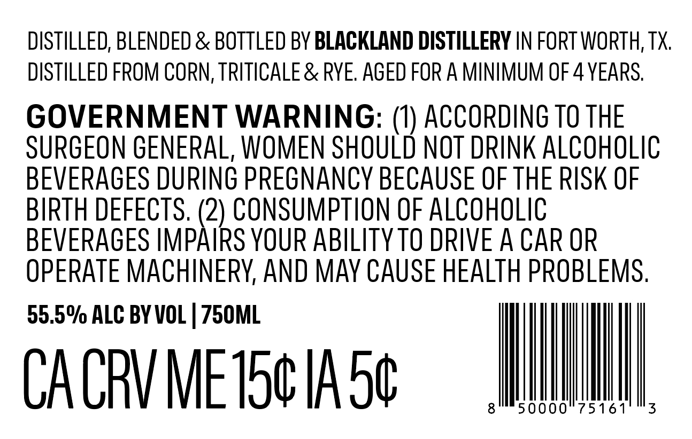
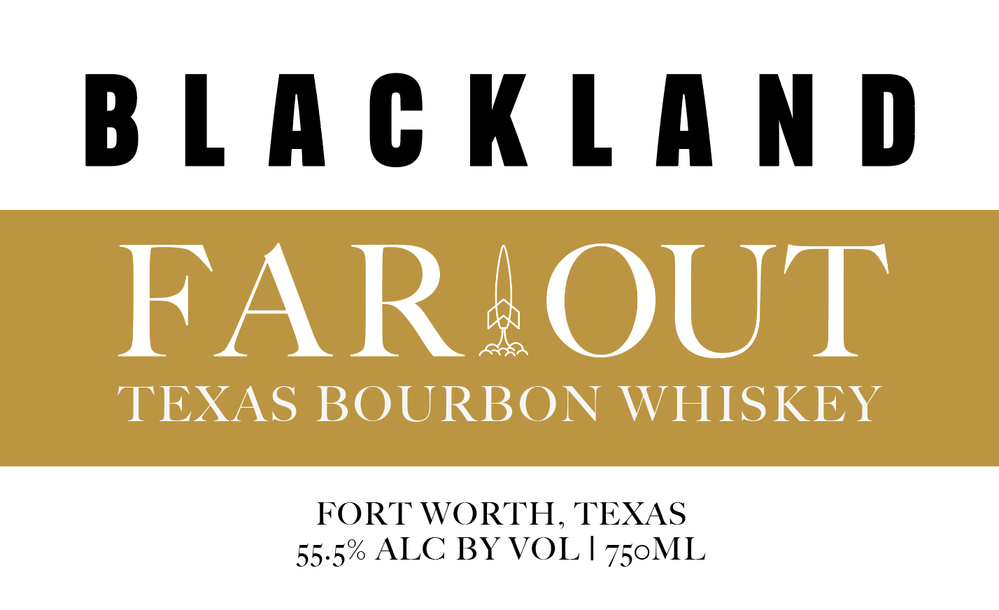

# TTB COLA Label Images - TTBID 26258001000238

**Brand Name:** FAR OUT TEXAS BOURBON

**Issue Date:** 09/20/2026

**Origin Code:** 44

**Product Class/Type:** 141

**Source:** [TTB Public COLA Registry](https://ttbonline.gov/colasonline/viewColaDetails.do?action=publicFormDisplay&ttbid=26258001000238)

## Label Images

### Back Label

### Front Label

## Extracted Label Text

*Text extracted via OCR - may contain errors*

**Detected Proof:** 111
**Detected Age:** 4 Years

### Back Label

DISTILLED, BLENDED & BOTTLED BY BLACKLAND DISTILLERY IN FORT WORTH, TX.
DISTILLED FROM CORN, TRITICALE & RYE. AGED FOR A MINIMUM OF 4 YEARS.
GOVERNMENT WARNING: (1) ACCORDING T0 THE
SURGEON GENERAL, WOMEN SHOULD NOT DRINK ALCOHOLIC
BEVERAGES DURING PREGNANCY BECAUSE OF THE RISK OF
BIRTH DEFECTS. (2) CONSUMPTION OF ALCOHOLIC
BEVERAGES IMPAIRS YOUR ABILITY TO DRIVE A CAR OR
OPERATE MACHINERY, AND MAY CAUSE HEALTH PROBLEMS.
CACRVMETOCIAS® = WINIAINI

### Front Label

B L A € KLAM D
FARAOUT
TEXAS BOURBON
WHISKEY
FORT WORTH_
TEXAS
55.5% ALC BY VOL | 750ML
