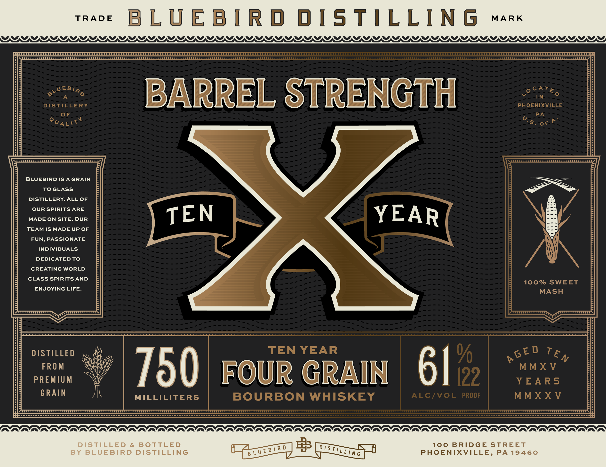
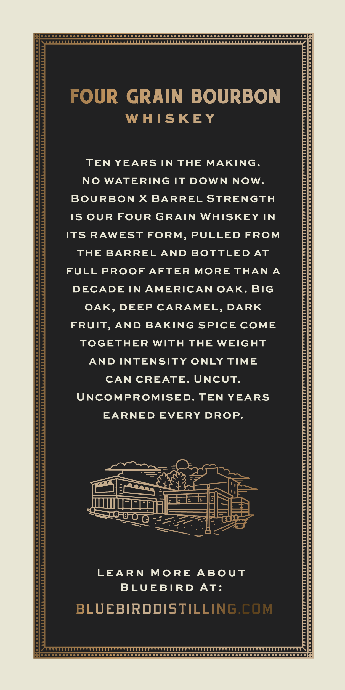
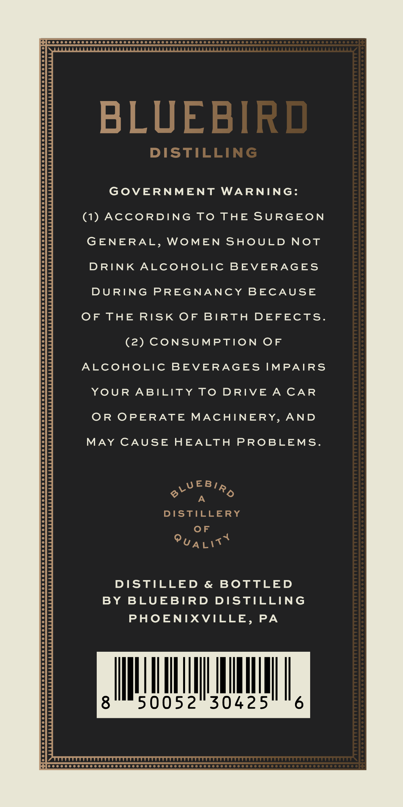
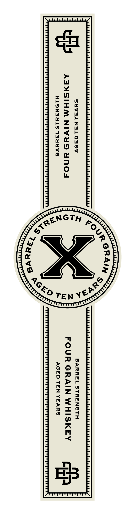

# TTB COLA Label Images - TTBID 26258001000239

**Brand Name:** BLUEBIRD DISTILLING

**Fanciful Name:** X BARREL STRENGTH

**Issue Date:** 09/18/2026

**Origin Code:** 39

**Product Class/Type:** 141

**Source:** [TTB Public COLA Registry](https://ttbonline.gov/colasonline/viewColaDetails.do?action=publicFormDisplay&ttbid=26258001000239)

## Label Images

### Label 1

### Label 2

### Label 3

### Label 4

## Extracted Label Text

*Text extracted via OCR - may contain errors*

### Label 1

mae BLUEBIRD DISTILLING x
WDD PLP ID JL IIJPDJIIDJLIDIJPIPLIJIJLIJIJ[DJLIJ)DIJLILIJPDJLIIJPDPIJIJDIJIJDJLIJIJPDIJLIJIJLIJJDJILIJDJLJLIJPJLDIDIJIIJILJILIIJPAIDIDJLDIDDJDDEIS

BLUEBIRD ISAGRAIN - <a

TOGLASS Fw
DISTILLERY. ALL OF =

OUR SPIRITS ARE N E
MADE ON SITE. OUR T : R N YW
TEAM IS MADE UP OF -

FUN, PASSIONATE ~

INDIVIDUALS

DEDICATED TO

CREATING WORLD
CLASS SPIRITS AND 100% SWEET
ENJOYING LIFE. MASH
DISTILLED = EAR GEY Te,

FROM XV
PREMIUM FARG

US Mh. MILLILITERS BOURBON WHISKEY

CC GOO > nooooooooooooonoon ::
OV Va Va Va Va Va Va Va Va Va Waa Van Wa Via Waa Waa Waa Waa Waa Waa Waa Waa Waa Waa Waa Waa Waa Waa Waa Waa Waa Waa Waa Waa Wan Wa Waa Wa Waa Waa Waa Waa Waa Waa Waa Waa Waa Waa Waa Waa Waa Waa Waa Wa Wa Wa Waa Waa Waa Va Wa)
"
eH wp =o) a 100 BRIDGE STREET
Ue veslk . 7) Banas! PHOENIXVILLE, PA 19460

### Label 2

FOUR GRAIN BOURBON
WHISKEY
TEN
YEARS IN
THE
MAKING_
No
WATERING
IT
DOWN
NOW
BOURBON
X
BARREL STRENGTH
IS OUR FOUR
GRAIN
WHISKEY IN
ITS
RAWEST FORM, PULLED
FROM
THE
BARREL AND BOTTLED
AT
FULL PROOF
AFTER
MORE THAN A
DECADE IN AMERICAN
OAK. BIG
OAK,
DEEP CARAMEL,
DARK
FRUIT,
AND
BAKING SPICE COME
TOGETHER
WITH
THE
WEIGHT
AND INTENSITY
ONLY TIME
CAN
CREATE
UNCUT.
UNCOMPROMISED. TEN
YEARS
EARNED
EVERY DROP_
LEARN
MoRE
ABUT
BLUEBIRD
At:
BLUEBIRDDISTILLING.cOM
WWWWWWWWW

### Label 3

BLUEBIRD
DISTILLING
GovERNMENT
WARNING:
(1)
AccoRDING
To
THE SURGEON
GENERAL,
WOMEN
SHOULD
NOt
DRINK ALCOHOLIC
BEVERAGES
DURING
PREGNANCY
BECAUSE
OF THE
Risk OF BIRTH
DEFECTS.
(2) CONSUMPTION OF
ALCOHOLIC
BEVERAGES
IMPAIRS
YOUR
ABILITY
To
DRIVE
A
CAR
OR
OPERATE MACHINERY,
AND
MAY CAUSE
HEALTH
PROBLEMS.
0LUEB/Ro
A
DISTILLERY
0F
QUALIT {
DISTILLED
&
BOTTLED
BY BLUEBIRD
DISTILLING
PHOENIXVILLE,
PA
8
50052
30425
6
W

### Label 4

BARREL STRENGTH

FOUR GRAIN WHISKEY ete

SYV3aA Nol da9Vv

cs ASXSIHM NIVUD 4NO4

HLONIAYLS 13y4yuvVa

AGED TEN YEARS
