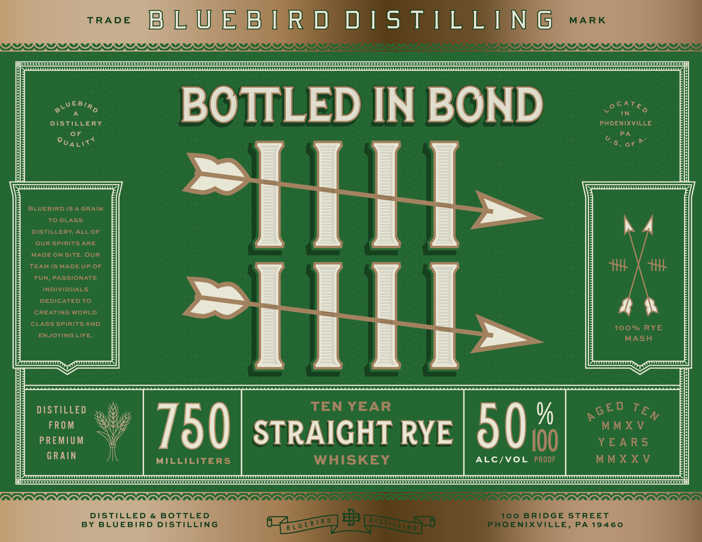
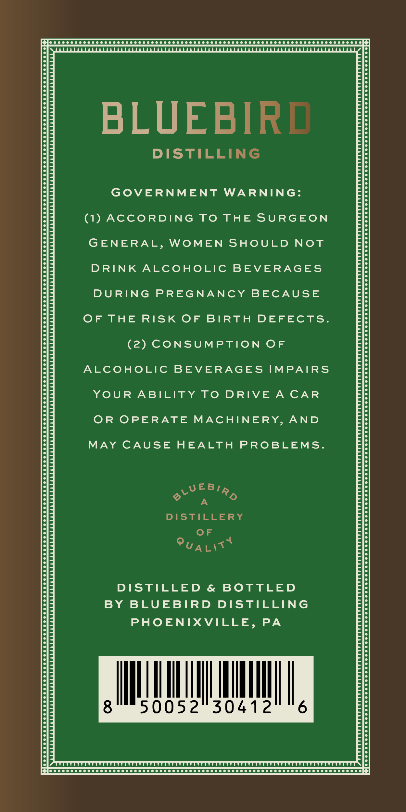
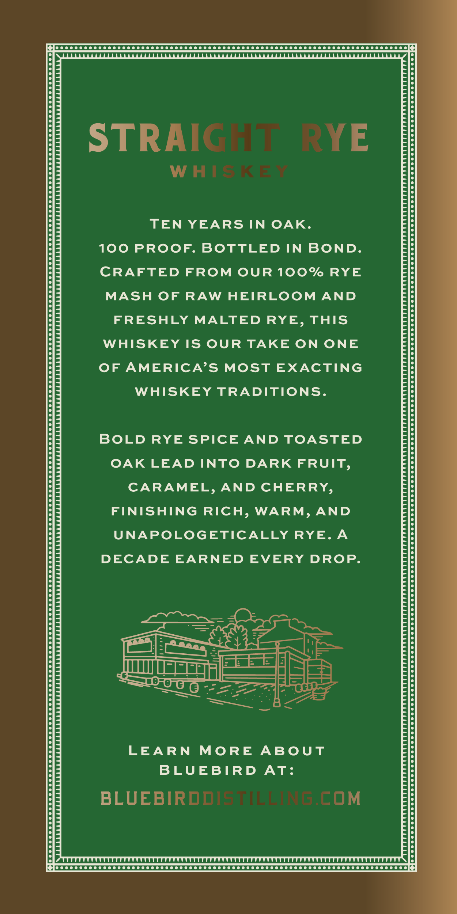
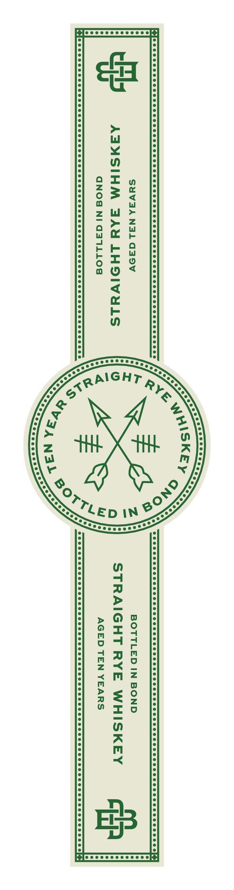

# TTB COLA Label Images - TTBID 26258001000245

**Brand Name:** BLUEBIRD DISTILLING

**Fanciful Name:** BIB 10 YEAR

**Issue Date:** 09/18/2026

**Origin Code:** 39

**Product Class/Type:** 102

**Source:** [TTB Public COLA Registry](https://ttbonline.gov/colasonline/viewColaDetails.do?action=publicFormDisplay&ttbid=26258001000245)

## Label Images

### Label 1

### Label 2

### Label 3

### Label 4

## Extracted Label Text

*Text extracted via OCR - may contain errors*

**Detected Proof:** 100

### Label 1

TRADE

Paar D DISTILLI NG

F[ococccccccccsccsscssccssees cesses ees ees eee eeS ees ees eeS TES TeS ODS STS TSS TES OOS OTS OS OSS TTS STS TE SOS OS SESS TE STE S OTST ESTOS OTS STS TSS TES OSS STS SOO ORSTTS TSS TOOTS SDSS TS OTTO TOS TS TES OS ESTOS OSS TES TES OTE STO TE TESTES TETeSTTSTES ese aie

DISTILLERY

BOTTLED IN BOND

Vat

pi fT if

ii

h A

Lid

>

|

P| i \

aoe

Td

) Is T ; L E )

PREMIU

G R Al N

= BD swe 0%

ALC/VOL

7A ANANA AANA AAAS OVO VO a a Va Van Va a Va a a

> gogo 6:

BY BLUEBIRD DISTILL

DISTILLED & BOTTLE

### Label 2

Jo 0 00 000000000000 000 000000000000 000 000000000000 000000000000000000 0000008

BLUEBIR!

DISTILLING

GOVERNMENT WARNING

(1) ACCORDING TO THE SURGEON

GENERAL, WOMEN SHOULD NOT

DRINK ALCOHOLIC BEVERAGES

DURING PREGNANCY BECAUSE

OF THE RISK OF BIRTH DEFECTS

(2) CONSUMPTION OF

ALCOHOLIC BEVERAGES IMPAIRS

YOUR ABILITY TO DRIVE A CAR

OR OPERATE MACHINERY, AND

MAY CAUSE HEALTH PROBLEMS

VEBip

A

DISTILLERY

OF

ua wiv

DISTILLED & BOTTLED

BY BLUEBIRD DISTILLING

PHOENIXVILLE, PA

ll

MUL

|

iM

I

50052

30412

ee eee CCC CCC CCC COTO TC CTO TTC TOTO TO OTTO TOOT T OOOO TC TOOTS OOOO OOOO

### Label 3

Jo 0 00 000000000500 0000000000005 00 0000000000090 000 0000000000000 0000000 0000008

STRAI

YE

WH!

TEN YEARS IN OAK

100 PROOF. BOTTLED IN BOND.

CRAFTED FROM OUR 100% RYE

MASH OF RAW HEIRLOOM AND

FRESHLY MALTED RYE, THIS

WHISKEY IS OUR TAKE ON ONE

OF AMERICA’S MOST EXACTING

WHISKEY TRADITIONS

BOLD RYE SPICE AND TOASTED

OAK LEAD INTO DARK FRUIT

CARAMEL, AND CHERRY

FINISHING RICH, WARM, AND

UNAPOLOGETICALLY RYE.A

DECADE EARNED EVERY DROP

Noon HO)

SS

a

ES

J USE Eas

Re

a

€ rr

we

LEARN MORE ABOUT

BLUEBIRD AT:

BLUEBIRDD

COM

eee eee eC eC C CC CT TCT T OTTO TOOTS COTO TOTO TOTO T OTTO TOTO TOOT OO OSS

### Label 4

BOTTLED IN BOND
STRAIGHT RYE WHISKEY
AGED TEN YEARS

SYV3A NIL adaSVv

AAZXMSIHM JAAY LHOIVYELS
GNOd NIG311104
