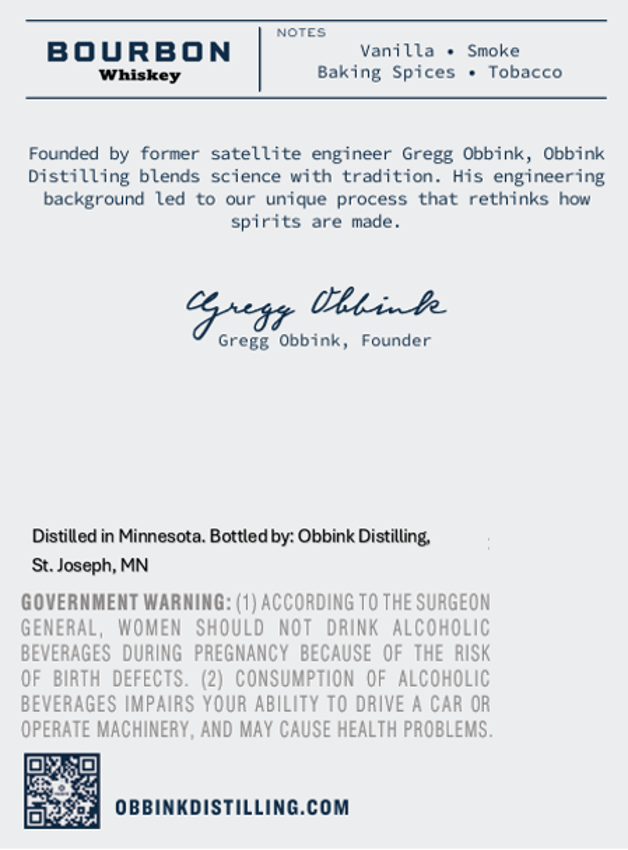
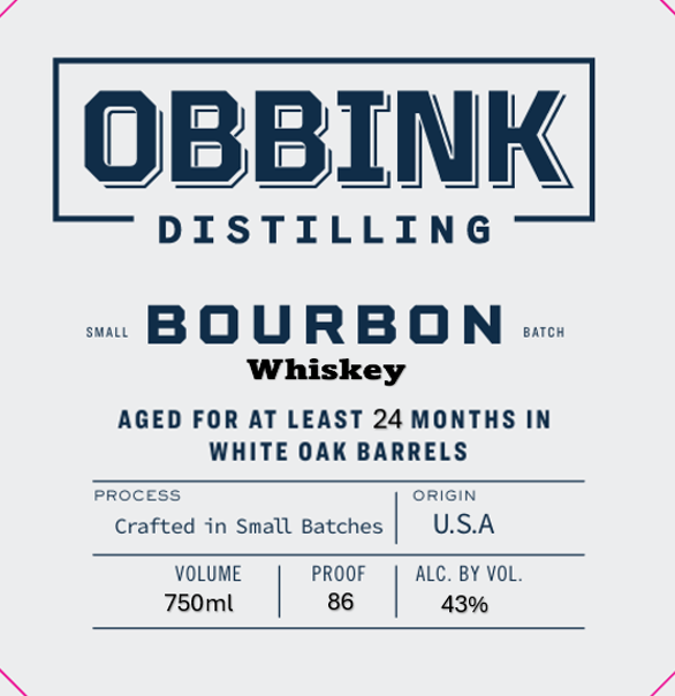

# TTB COLA Label Images - TTBID 26258001000279

**Brand Name:** OBBINK DISTILLING

**Issue Date:** 09/22/2026

**Origin Code:** 27

**Product Class/Type:** 101

**Source:** [TTB Public COLA Registry](https://ttbonline.gov/colasonline/viewColaDetails.do?action=publicFormDisplay&ttbid=26258001000279)

## Label Images

### Back Label

### Front Label

## Extracted Label Text

*Text extracted via OCR - may contain errors*

**Detected Proof:** 86

### Back Label

NOTES
BOURBON
Vanilla
Smoke
Whiskey
Baking Spices
Tobacco
Founded by former
satellite engineer Gregg Obbink, Obbink
Distilling blends science with tradition. His engineering
background led to
our unique process that rethinks how
spirits are made
Gxar Ulink
Gregg Obbink,
Founder
Distilled in Minnesota. Bottled by: Obbink Distilling;
St: Joseph; MN
GOVERNMENT WARNING: (1) ACCORDING TO THE SURGEON
GEMERAL,  WOMEM
SHOULD NoT dRINK Alcoholic
BEVERAGES   DURING   PREGNANCY  BECAUSE   OF THE   RISK
OF BIRtH DEFECTS. (2) consumption OF AlcohOLiC
BEVERAGES IMPAIRS YOUR ABILITY TO DRIVE A Car OR
OPERATE MACHINERY, AND May CAUSE HEALTH PROBLEMS .
OBBINKDISTILLING.COM

### Front Label

obBINK
D ISTILLING
SMALL
BOURBON
Batch
Whiskey
AGED For AT LEAST 24 Months in
WHIte OAK BARRELS
PROCEss
origin
Crafted in Small Batches
U.S.A
VOLUME
PROOF
ALC. BY VOL.
750ml
86
43%
