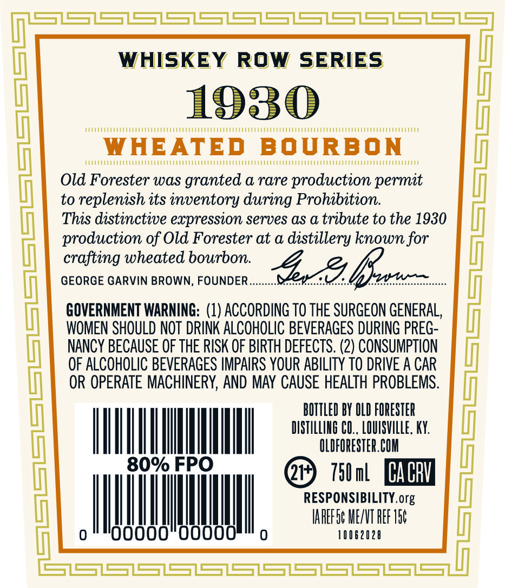
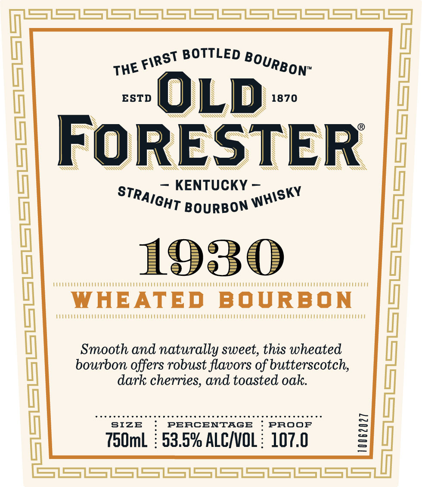
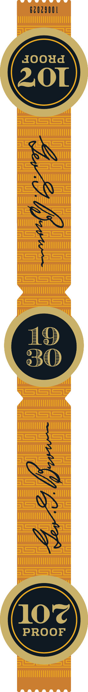

# TTB COLA Label Images - TTBID 26258001000282

**Brand Name:** OLD FORESTER

**Fanciful Name:** 1930 WHEATED BOURBON

**Issue Date:** 09/23/2026

**Origin Code:** 22

**Product Class/Type:** 101

**Source:** [TTB Public COLA Registry](https://ttbonline.gov/colasonline/viewColaDetails.do?action=publicFormDisplay&ttbid=26258001000282)

## Label Images

### Back Label

### Front Label

### Label 3

## Extracted Label Text

*Text extracted via OCR - may contain errors*

*1 image(s) excluded: text did not meet readability threshold*

**Detected Proof:** 107

### Back Label

WHISKEY ROW SERIES

1930

Me

WHEATED BOURBON

MMO

Old Forester was granted a rare production permit

to replenish its inventory during Prohibition

This distinctive expression serves as a tribute to the 1930

production of Old Forester at a distillery known for

crafting wheated bourbon.

GEORGE GARVIN BROWN, FOUNDER...

GOVERNMENT WARNING: (1) ACCORDING T0 THE SURGEON GENERAL,

WOMEN SHOULD NOT DRINK ALCOHOLIC BEVERAGES DURING PREG-

NANCY BECAUSE OF THE RISK OF BIRTH DEFECTS. (2) CONSUMPTION

OF ALCOHOLIC BEVERAGES IMPAIRS YOUR ABILITY TO DRIVE A CAR

OR OPERATE MACHINERY, AND MAY CAUSE HEALTH PROBLEMS

BOTTLED BY OLD FORESTER

DISTILLING CO., LOUISVILLE, KY.

ITLL

@ Tia COM

@ 70a EE

RESPONSIBILITY. org

A,

IAREFG¢ ME/VT REF 15¢

10062028

### Front Label

SZSZSZS=ZS=ZS7S=ZSSZS=7S=7S=Z
BOTTLED
ESTD
OLD
1870
FoRESTER
KENTUCKY
A
1930
BOURBON
(
WHEATED
BOURBON
Smooth and naturally sweet, this wheated
bourbon offers robust flavors of butterscotch;
dark cherries; and toasted oak:
SIZE
PERCENTAGB
PROOF
750ml
53.5% ALCINOL :
107.0
IX
FIRST
BOURBON"
THE
STRAIGHT
WHISKY
