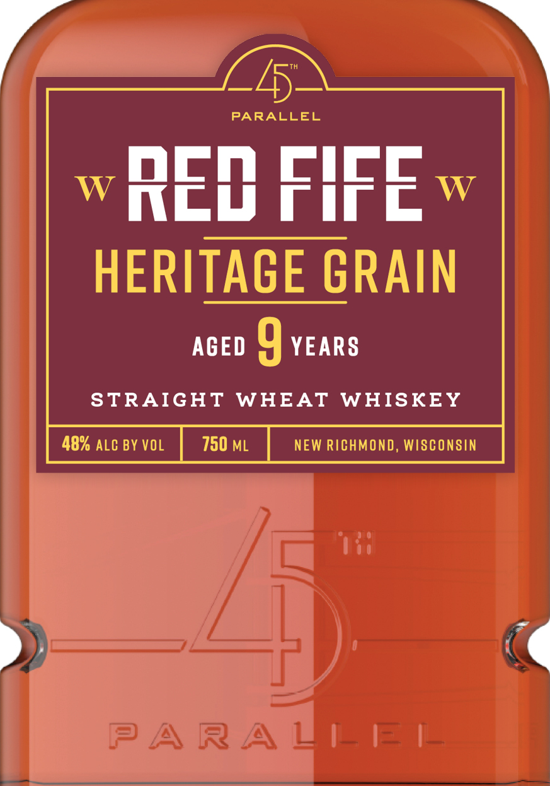
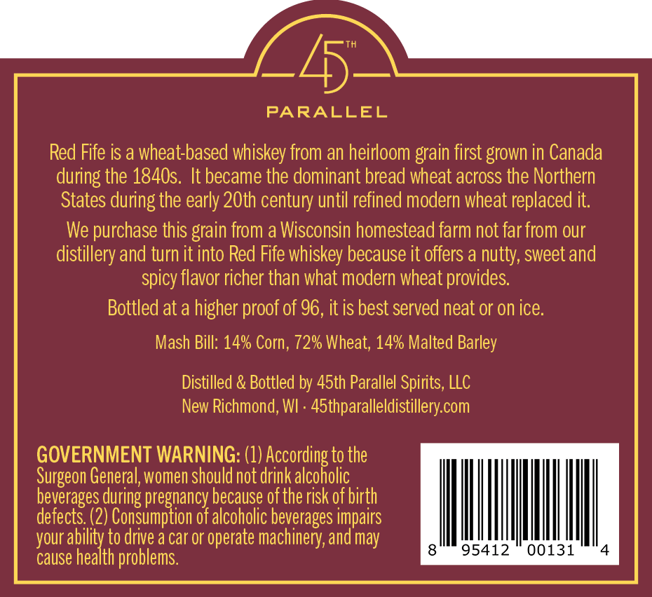

# TTB COLA Label Images - TTBID 26258001000287

**Brand Name:** 45TH PARALLEL

**Fanciful Name:** RED FIFE

**Issue Date:** 10/01/2026

**Origin Code:** 48

**Product Class/Type:** 109

**Source:** [TTB Public COLA Registry](https://ttbonline.gov/colasonline/viewColaDetails.do?action=publicFormDisplay&ttbid=26258001000287)

## Label Images

### Label 1

### Label 2

## Extracted Label Text

*Text extracted via OCR - may contain errors*

**Detected Proof:** 96
**Detected Age:** 9 Years

### Label 1

PARALLEL
REW FIFE
W
HERITAGE GRAIN
AGED
9 YEARs
STRAIGHT
WHEAT
WHISKEY
48% ALC BY VOL
750 ML
NEW RICHMOND , WISCONSIN
PARAZEE

### Label 2

PARALLEL
Red Fife is a wheat-based whiskey from an heirloom grain first grown in Canada
during the 1840s. It became the dominant bread wheat across the Northern
States during the early 2Oth century until refined modern wheat replaced it;
We purchase this grain from a Wisconsin homestead farm not far
our
distillery and turn it into Red Fife whiskey because it offers a nutty, sweet and
spicy flavor richer than what modern wheat provides
Bottled at a higher
of 96, it is best served neat or on ice.
Mash Bill: 14% Corn; 72% Wheat; 14% Malted Barley
Distilled & Bottled by 45th Parallel Spirits, LLC
New Richmond, WI . 45thparalleldistillery com
GOVERNMENT WARNING: (1)
Ufecondiaxdotl
to the
General, women should not drink
beverages during pregnancy because ofthe risk of birth
defects. (2) Consumption of alcoholic beverages impairs
your ability to drive a car or operate machinery, and may
95412
00131
cause health problems:
from
proof .
Surgeon !
