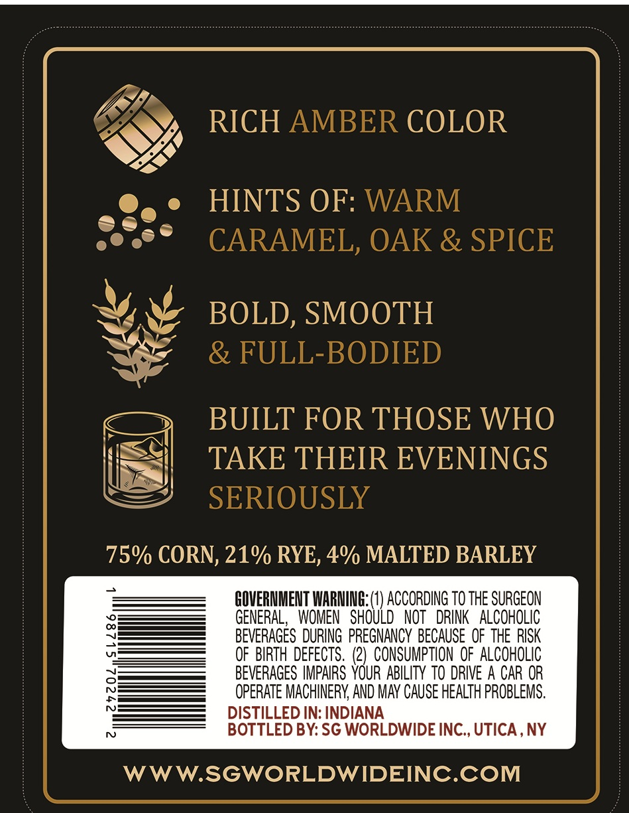
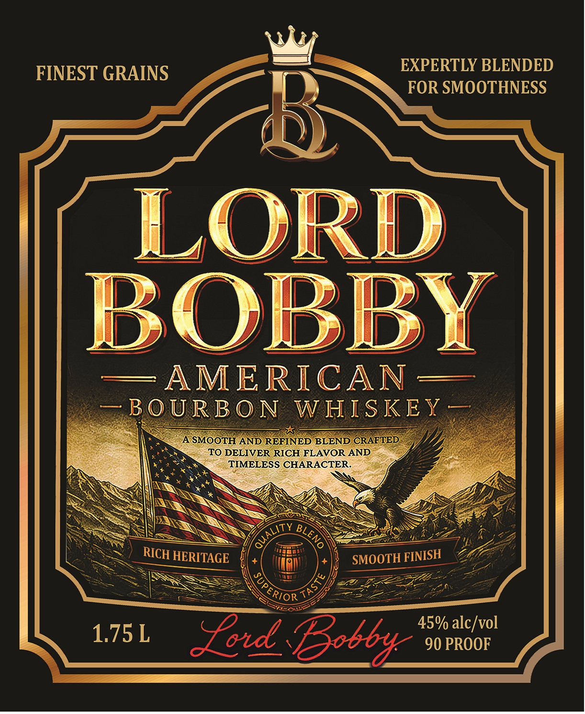

# TTB COLA Label Images - TTBID 26258001000316

**Brand Name:** LORD BOBBY

**Issue Date:** 09/21/2026

**Origin Code:** 02

**Product Class/Type:** 141

**Source:** [TTB Public COLA Registry](https://ttbonline.gov/colasonline/viewColaDetails.do?action=publicFormDisplay&ttbid=26258001000316)

## Label Images

### Back Label

### Label 1

## Extracted Label Text

*Text extracted via OCR - may contain errors*

**Detected Proof:** 90

### Back Label

RICH AMBER COLOR
HINTS OF: WARM
CARAMEL, OAK & SPICE
BOLD, SMOOTH
& FULL-BODIED
BUILT FOR THOSE WHO
TAKE THEIR EVENINGS
SERIOUSLY
75% CORN; 21% RYE, 4% MALTED BARLEY
GOVERNMENT WARNING; (1) ACCORDING TO ThE SURGEON
0
GENERAL;
WOMEN   SHOULD   NOT   DRINK   ALCOHOLIC
BEVERAGES  DURING PREGNANCY  BECAUSE  OF THE RISK
OF  BIRTH DEFECTS . (2)   CONSUMPTION OF ALCOHOLIC
BEVERAGES IMPAIRS YOUR ABILITY TO DRIVE A CAR OR
8
OPERATE MACHINERY AND MAY CAUSE HEALTH PROBLEMS.
DISTILLED IN: INDIANA
BOTTLED BY: SG WORLDWIDE INC , UTICA , NY
WWW.SGWORLDWIDEINC.COM

### Label 1

FINEST GRAINS
EXPERTLY BLENDED
FOR SMOOTHNESS
6
LORD
BOBBY
AMERICAN
B O URB O N
W HISKEY _
A SMOOTH AND REFINED BLEND CRAFTED
TO DELIVER RICH FLAVOR AND
TIMELESS CHARACTER.
HERITAGE
SMOOTH
"ES
45% alc/vol
1.75 L
Fo Bob6
90 PROOF
JUALITY
BLENo
RICH
FINISH
TAST'
'ERIOR
