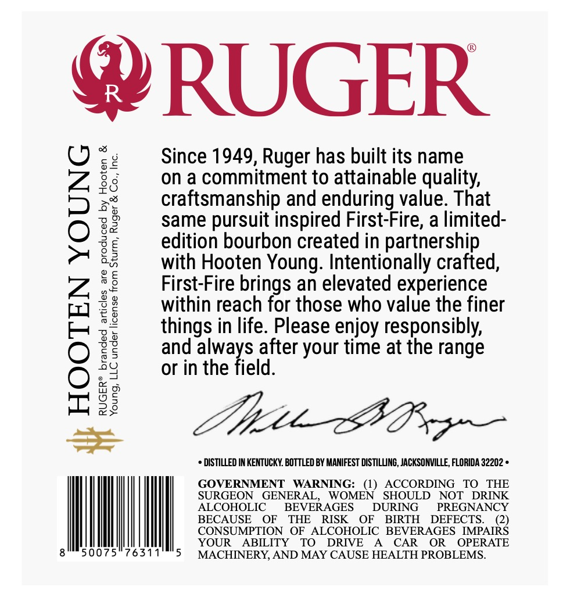
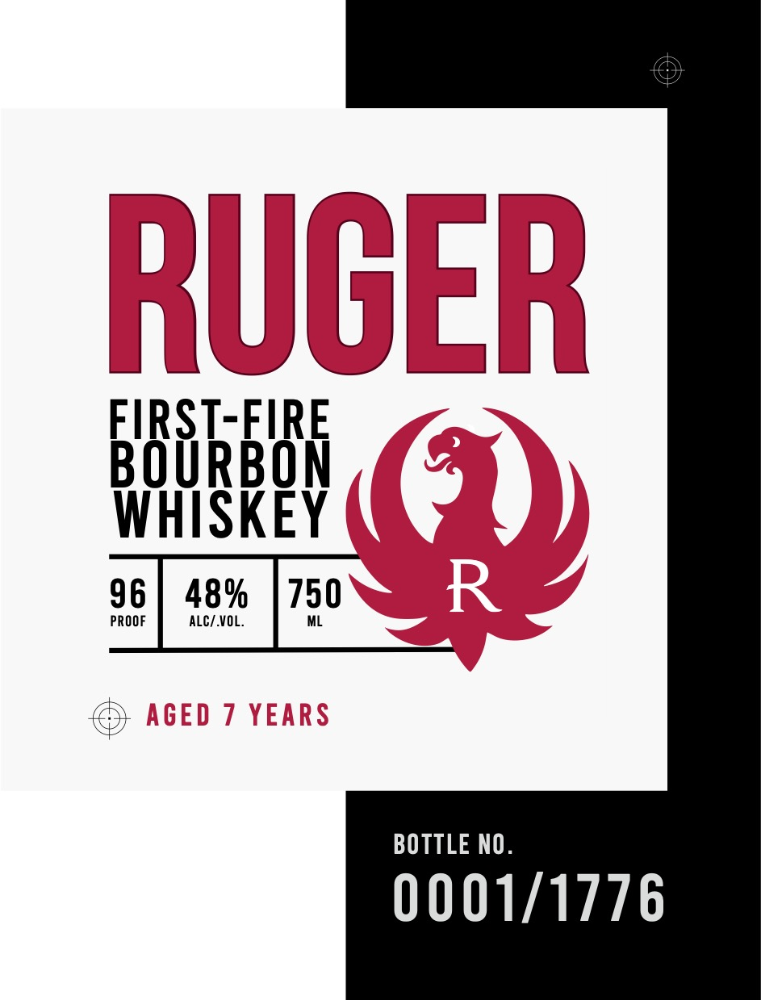
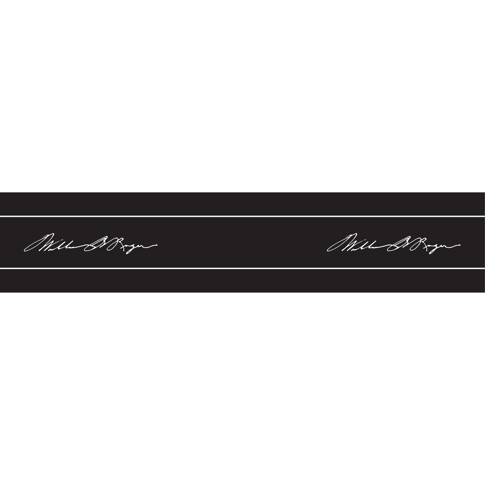
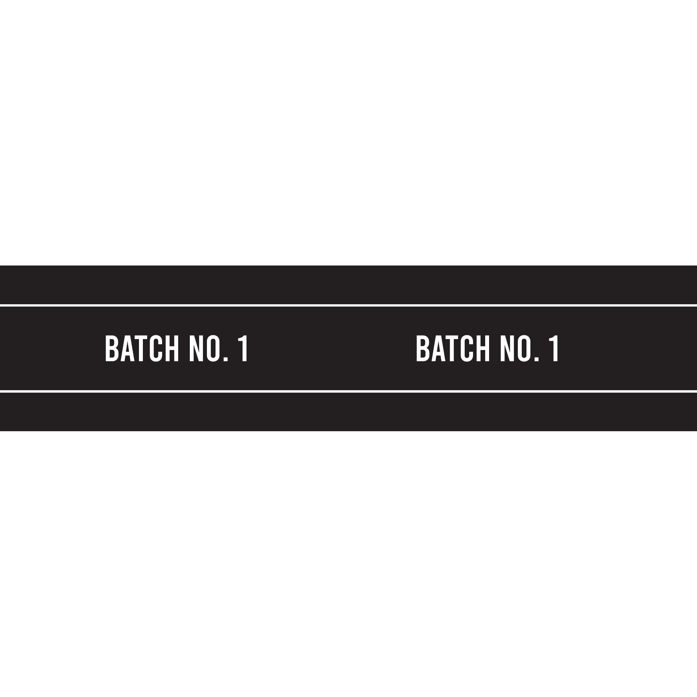

# TTB COLA Label Images - TTBID 26258001000334

**Brand Name:** RUGER

**Issue Date:** 09/21/2026

**Origin Code:** 16

**Product Class/Type:** 141

**Source:** [TTB Public COLA Registry](https://ttbonline.gov/colasonline/viewColaDetails.do?action=publicFormDisplay&ttbid=26258001000334)

## Label Images

### Back Label

### Front Label

### Label 3

### Label 4

## Extracted Label Text

*Text extracted via OCR - may contain errors*

*2 image(s) excluded: text did not meet readability threshold*

**Detected Proof:** 96

### Back Label

@ RUGER

Since 1949, Ruger has built its name

on a commitment to attainable quality,
craftsmanship and enduring value. That
same pursuit inspired First-Fire, a limited-
edition bourbon created in partnership
with Hooten Young. Intentionally crafted,
First-Fire brings an elevated experience
within reach for those who value the finer
things in life. Please enjoy responsibly,
and always af after your time at the range
or in the

+ DISTILLED IN KENTUCKY. BOTTLED BY MANIFEST DISTILLING, JACKSONVILLE, FLORIDA 32202 «

GOVERNMENT WARNING: (1) ACCORDING TO THE
SURGEON GENERAL, WOMEN SHOULD NOT DRINK

Young, LLC under license from Sturm, Ruger & Co., Inc.

HOOTEN YOUNG
RUGER® branded articles are produced by Hooten &

i

ALCOHOLIC BEVERAGES DURING PREGNANCY
BECAUSE OF THE RISK OF BIRTH DEFECTS. (2)
CONSUMPTION OF ALCOHOLIC BEVERAGES IMPAIRS
YOUR ABILITY TO DRIVE A CAR OR OPERATE
0075°763 MACHINERY, AND MAY CAUSE HEALTH PROBLEMS.

### Front Label

RUGER

BRR Baw

WHISKEY (

96

PROOF ALC/.VOL.

48%

750 '

BOTTLE NO

0001/1776
