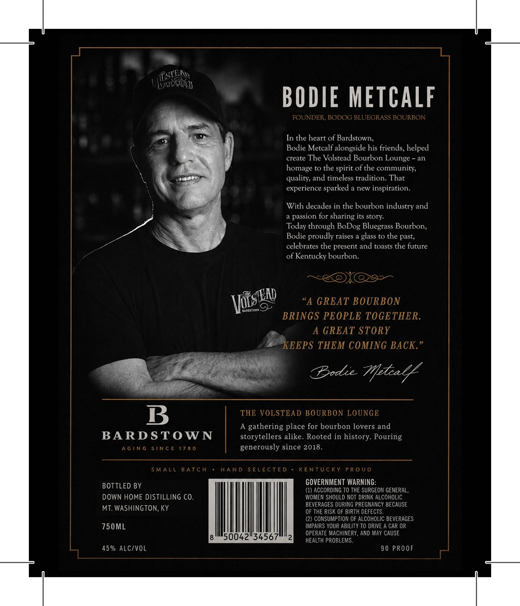
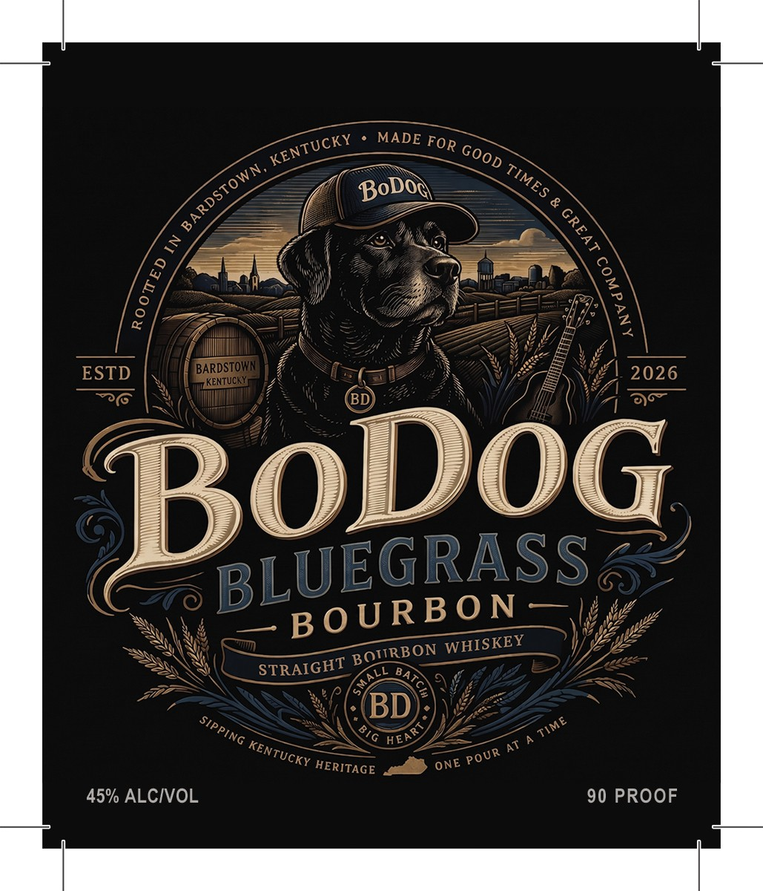

# TTB COLA Label Images - TTBID 26258001000356

**Brand Name:** BO DOG

**Issue Date:** 09/23/2026

**Origin Code:** 22

**Product Class/Type:** 101

**Source:** [TTB Public COLA Registry](https://ttbonline.gov/colasonline/viewColaDetails.do?action=publicFormDisplay&ttbid=26258001000356)

## Label Images

### Back Label

### Front Label

## Extracted Label Text

*Text extracted via OCR - may contain errors*

**Detected Proof:** 90

### Back Label

VEccR
BODIE METCALF
FOUNDER , BODOG BLUEGRASS BOURBON
In the heart of Bardstown,
Bodie Metcalf alongside his friends, helped
create The Volstead Bourbon Lounge
homage to the spirit of the community,
quality; and timeless tradition. That
experience sparked
new inspiration.
With decades in the bourbon industry and
passion for sharing its story:
Today through BoDog Bluegrass Bourbon,
Bodie proudly raises
glass t0 the past,
celebrates the present
toasts the future
of Kentucky bourbon:
"A GREAT BOURBON
BRINGS PEOPLE TOGETHER.
A GREAT STORY
KEEPS THEM COMING BACK "
Dodic Tfca4
B
THE VOLSTEAD BOURBON LOUNGE
A gathering place for bourbon lovers and
BARDSTOWN
storytellers alike
Rooted in history Pouring
AGING
SiNCE 17 8 0
generously since 2018
SMALL
BATCA
HAND
S ELECTEd
KENTUCKY
P RoUD
BOTTLED BY
GOVERNMENT WARNING:
(1) ACCORDING TO THE SURGEON GENERAL;
DOWN HOME DISTiLLING CO
WOMET SHOULD NOT DRINK ALCOHOLIC
MT WASHINGTON, Ky
BEVERAGES DURING PREGMANCY BECAUSE
QF THE RISK QF BIRTH DEFECTS
(2) CONSUMPTION OF ALCOHOLIC BEVERAGES
750ML
IMPAIPS YOUR ABILITY TO DRIVE
CAR OR
OPERATE MACHINERY, AND MaY CAUSE
50042"34567
HEALTH PROBLEMS
45% Alc/vol
9 0
PROOF
and
VucsEn

### Front Label

MADE
~
ESTD
BARDSTOWN
2026
KENTUCKY
BoDoG
BLEoUABonSS
WHISKEY
STRAIGHT
BA
BD
HEAS
AT
45% ALCIVOL
90 PROOF
KENTUCKY
FOR
GOOD
ARDSTOWN,
TIMES
BoDoq
1
1
8
{
BOVIRBON
ALL
SIPPING
TIME
KENTUCKY
POUR
ONE
HERITAGE
