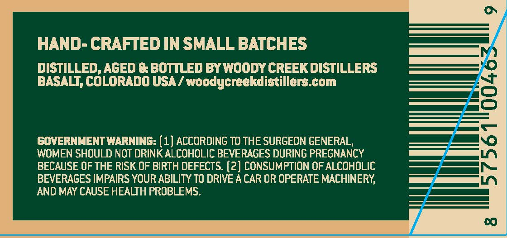
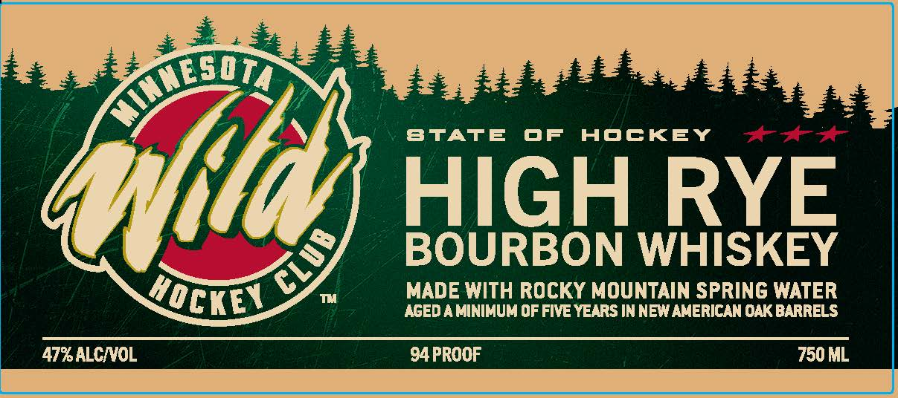

# TTB COLA Label Images - TTBID 26258001000382

**Brand Name:** WOODY CREEK DISTILLERS

**Issue Date:** 09/17/2026

**Origin Code:** 13

**Product Class/Type:** 141

**Source:** [TTB Public COLA Registry](https://ttbonline.gov/colasonline/viewColaDetails.do?action=publicFormDisplay&ttbid=26258001000382)

## Label Images

### Back Label

### Front Label

### Label 2

## Extracted Label Text

*Text extracted via OCR - may contain errors*

*1 image(s) excluded: text did not meet readability threshold*

**Detected Proof:** 94

### Back Label

HAND- CRAFTED IN SMALL BATCHES
DISTILLED, AGED & BOTTLED BY WOODY CREEK DISTILLERS
BASALT, COLORADO USA / woodycreekdistillers com
GOVERNMENT WARNING: (1) ACCORDING TO THE SURGEON GENERAL,
1
WOMEN SHOULD NOT DRINK ALCOHOLIC BEVERAGES DURING PREGNANCY
BECAUSE OF THE RISK OF BIRTH DEFECTS. (2) CONSUMPTION OF ALCOHOLIC
BEVERAGES IMPAIRS YOUR ABILITY TO DRIVE A CAR OR OPERATE MACHINERY
AND MAY CAUSE HEALTH PROBLEMS:
0

### Front Label

BTATE
OF
HOCKEY
{ta
HIGH
RYE
BOURBON WHISKEY
MADE WITH ROCKY MOUNTAIN SPRING WATER
AGED A MINIMUM OF FIvE YEARS IN NEW AMERICAN OAK BARRELS
47%ALCNOL
94 PROOF
750 ML
XTED
3
HOcKEy
