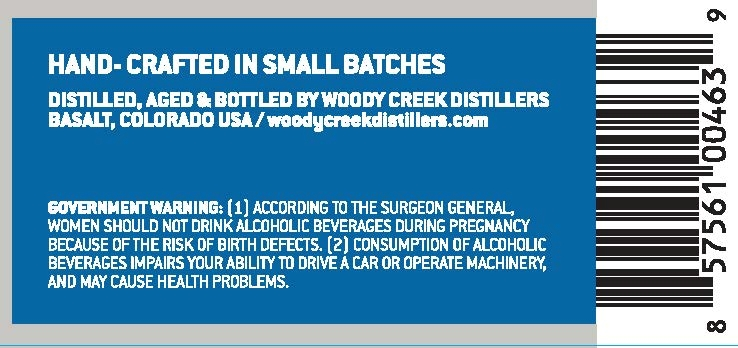
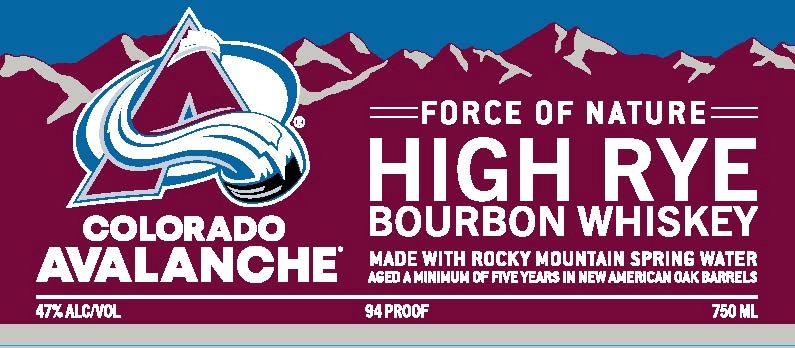

# TTB COLA Label Images - TTBID 26258001000393

**Brand Name:** WOODY CREEK DISTILLERS

**Issue Date:** 09/17/2026

**Origin Code:** 13

**Product Class/Type:** 141

**Source:** [TTB Public COLA Registry](https://ttbonline.gov/colasonline/viewColaDetails.do?action=publicFormDisplay&ttbid=26258001000393)

## Label Images

### Back Label

### Front Label

### Label 2

## Extracted Label Text

*Text extracted via OCR - may contain errors*

*1 image(s) excluded: text did not meet readability threshold*

### Back Label

HAND- CRAFTED IN SMALL BATCHES
DISTILLED; Aged * BoTTLED By Woody creek dISTILERs
BASALT; COLORADO USA/ woodycreekdistillers tom
EOVERNMENT WARNING: (1] AccORdiNG TO THE SURGEON GENERAL,
WOMEN SHOULD NOT DRINK ALCOHOLIC BEVERAGES DURING PREGMANCY
BECAUSE OF THE RISK OF BIRTH DEFECTS: (2) CONSUMPTION OF ALCOHOLIC
BEVERAGES IMPAIRS YOUR ABILITY T0 DRIVEA CAR OR OPERATE MACHINERY;
AND MAY CAUSE HEALTH PROBLEMS.

### Front Label

~=FORCE OF NATURE
HIGH RYE
COLORADO
BOURBON WHISKEY
AVALANCHE
MADE WITH ROCKY MOUNTAIN SPRING WATER
ASEO
MINIMUMC FMEYENs IN NEWAMERICNNOAKBARRELS
47XALCNCL
94PROCF
75ML
