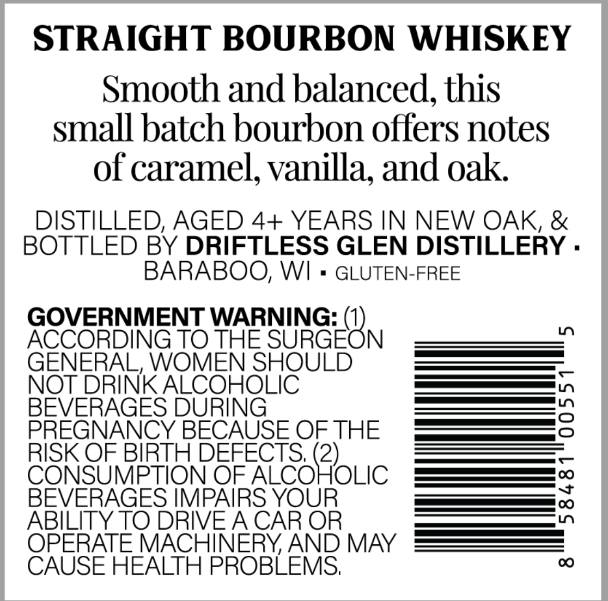
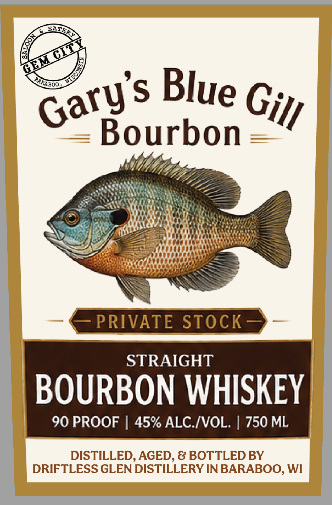

# TTB COLA Label Images - TTBID 26258001000418

**Brand Name:** GARY'S BLUE GILL BOURBON

**Issue Date:** 09/17/2026

**Origin Code:** 48

**Product Class/Type:** 101

**Source:** [TTB Public COLA Registry](https://ttbonline.gov/colasonline/viewColaDetails.do?action=publicFormDisplay&ttbid=26258001000418)

## Label Images

### Back Label

### Front Label

## Extracted Label Text

*Text extracted via OCR - may contain errors*

**Detected Proof:** 90

### Back Label

STRAIGHT BOURBON WHISKEY
Smooth and balanced, this
small batch bourbon offers notes
of caramel; vanilla; and oak
DISTILLED; AGED 4+ YEARS IN NEW OAK, &
BOTTLED BY DRIFTLESS GLEN DISTILLERY .
BARABOO; WI
GLUTEN-FREE
GOVERNMENT WARNING:
1
ACCQRDING TO THE SURGEON
GENERAL, WOMEN SHOULD
NOT DRINK ALCOHOLIC
BEVERAGES DURING
3
PREGNANCY BECAUSE OF THE
RISK OF BIRTH DEFECTS, (2)
CONSUMPTION OF ALCOHOLIC
BEVERAGES IMPAIRS YOUR
1
ABILITYTO DRIVEACAR OR
OPERATE MACHINERYAND MAY
CAUSE HEALTH PROBLEMS;
00

### Front Label

YA % BATES
es.
SaRBGO
Gary s Blue Giy
wis’ eh Mid ——
SFY VI
. @) , jonni Dies i Ny: aay hiivanensit ZA
mrt ye a NY Via! Oy eect eeccn ==
NIG" A a3 HN =
S) SS SS
Lao MO — SS
> RRIVATE STOCK
STRAIGHT
90 PROOF | 45% ALC./VOL. | 750 ML
DISTILLED, AGED, & BOTTLED BY
DRIFTLESS GLEN DISTILLERY IN BARABOO, WI
