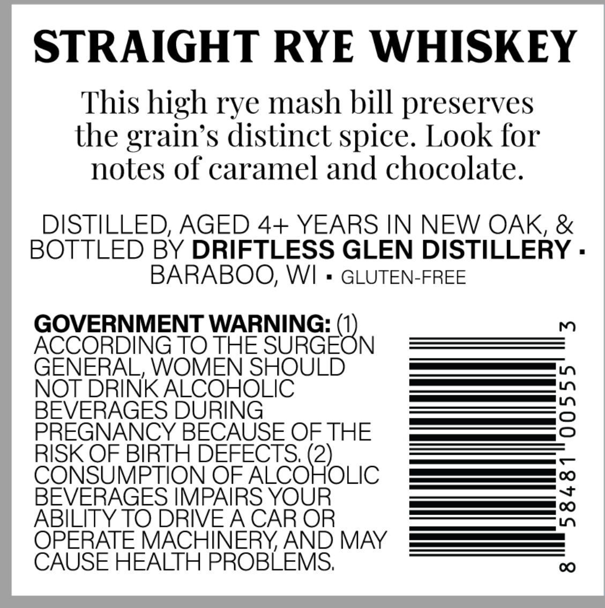
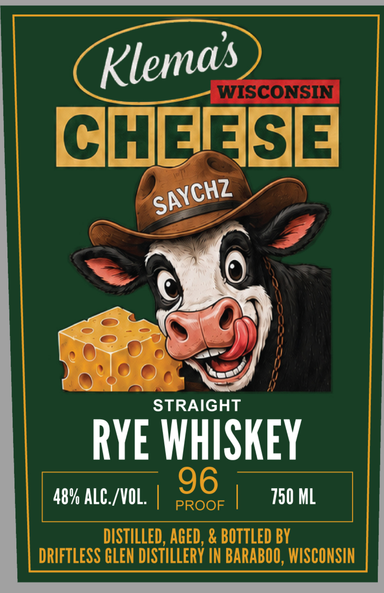

# TTB COLA Label Images - TTBID 26258001000438

**Brand Name:** KLEMA'S WISCONSIN CHEESE

**Issue Date:** 09/17/2026

**Origin Code:** 48

**Product Class/Type:** 102

**Source:** [TTB Public COLA Registry](https://ttbonline.gov/colasonline/viewColaDetails.do?action=publicFormDisplay&ttbid=26258001000438)

## Label Images

### Back Label

### Front Label

## Extracted Label Text

*Text extracted via OCR - may contain errors*

**Detected Proof:** 96

### Back Label

STRAIGHT RYE WHISKEY
This high rye mash bill preserves
the grain's distinct
Look for
notes f caramel and chocolate.
DISTILLED, AGED 4+ YEARS IN NEW OAK, &
BOTTLED BY DRIFTLESS GLEN DISTILLERY .
BARABOO; WI
GLUTEN-FREE
GOVERNMENT WARNING: (1
m
ACCORDING TO THE SURGEON
GENERAL, WOMEN SHOULD
NOT DRINK ALCOHOLIC
BEVERAGES DURING
3
PREGNANCY BECAUSE OF THE
RISK OF BIRTH DEFECTS (2)
CONSUMPTION OF ALCOHOLIC
BEVERAGES IMPAIRS YOUR
1
ABILITY TO DRIVEACAR OR
OPERATE MACHINERY AND MAY
CAUSE HEALTH PROBLEMS;
0
spice.

### Front Label

WISCONSIN
CHENASE
STRAIGHT
RYE WHISKEY
96
48% ALC./VOL:
PROOF
750 ML
DISTILLED, AGED, & BOTTLED BY
DRIFTLESS GLEN DISTILLERY IN BARABOO, WISCONSIN
Klemas
SAYCHZ
