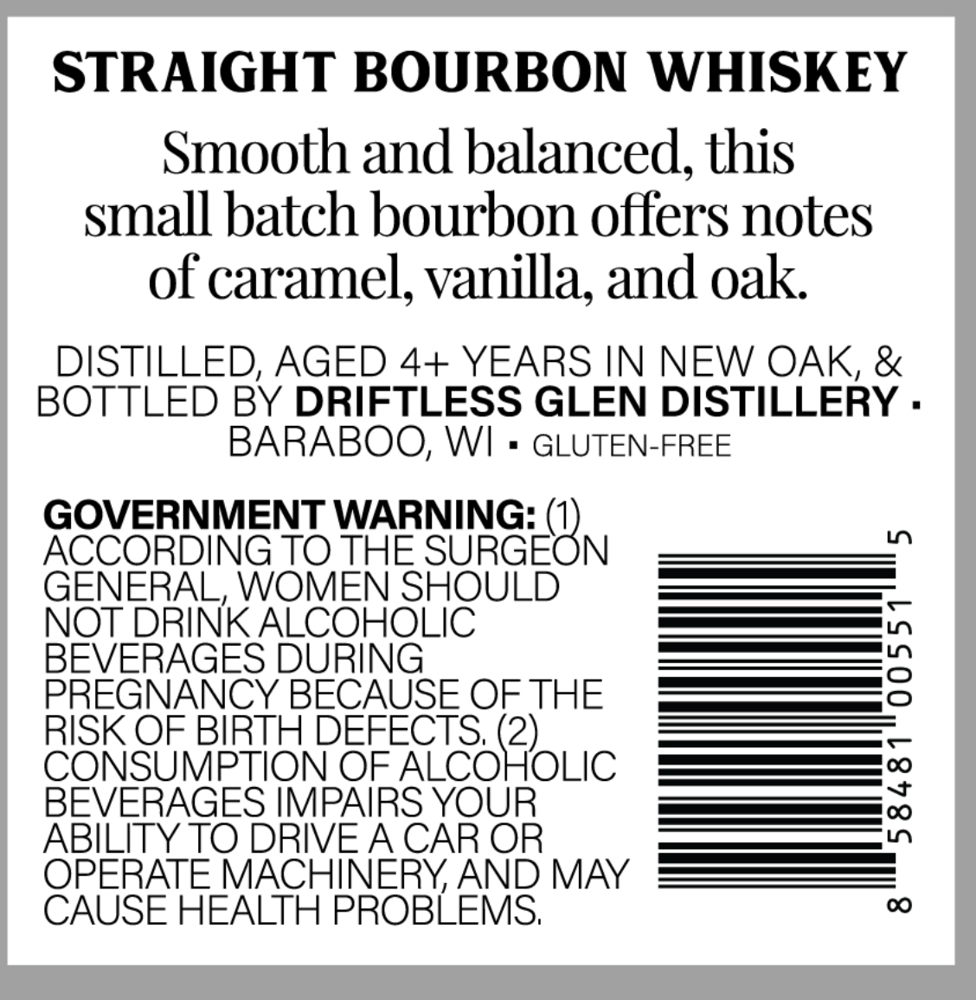
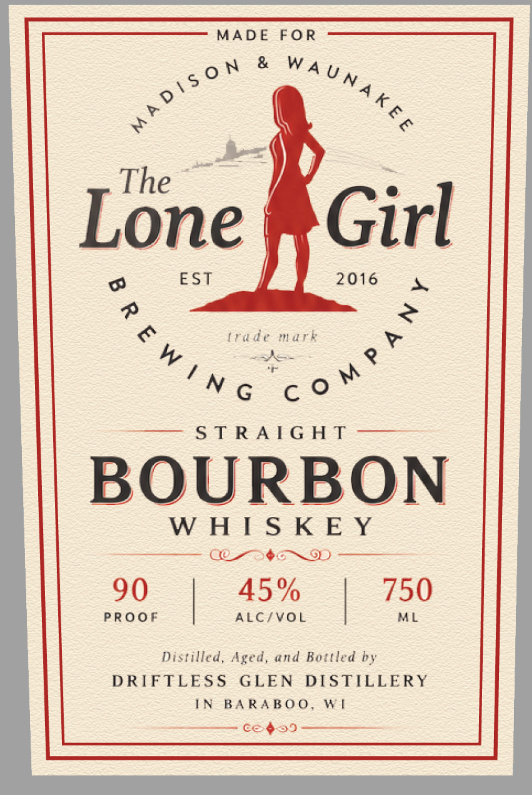

# TTB COLA Label Images - TTBID 26258001000459

**Brand Name:** THE LONE GIRL

**Issue Date:** 09/18/2026

**Origin Code:** 48

**Product Class/Type:** 101

**Source:** [TTB Public COLA Registry](https://ttbonline.gov/colasonline/viewColaDetails.do?action=publicFormDisplay&ttbid=26258001000459)

## Label Images

### Back Label

### Front Label

## Extracted Label Text

*Text extracted via OCR - may contain errors*

**Detected Proof:** 90

### Back Label

STRAIGHT BOURBON WHISKEY
Smooth and balanced, this
small batch bourbon offers notes
of caramel, vanilla; and oak
DISTILLED; AGED 4+ YEARS IN NEW OAK, &
BOTTLED BY DRIFTLESS GLEN DISTILLERY .
BARABOO; WI
GLUTEN-FREE
GOVERNMENT WARNING:
0
ACCORDING TO THE SURGEON
GENERAL, WOMEN SHOULD
NOT DRINK ALCOHOLIC
BEVERAGES DURING
2
PREGNANCY BECAUSE OFTHE
RISK OF BIRTH DEFECTS; (2)
C
CONSUMPTION OF ALCOHOLIC
BEVERAGES IMPAIRS YOUR
:
ABILITY TO DRIVEA CAR OR
OPERATE MACHINERYAND MAY
CAUSE HEALTH PROBLEMS,
00

### Front Label

MADE FOR

ie

The —

L

one

Girl

EST

2016

=

¢

trade mark

atc

g

Nc cot

aia is Bel Sn OS «Fes Semen

OURBO

WHISKEY

ees

Cone ~D

90

45%

PROOF

ALC/VOL

|

| 750

istilled, Aged, and Bottled by

DRIFTLESS GLEN DISTILLERY

IN BARABOO, WI

= €2$59
