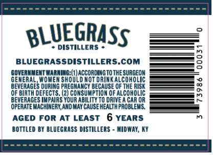
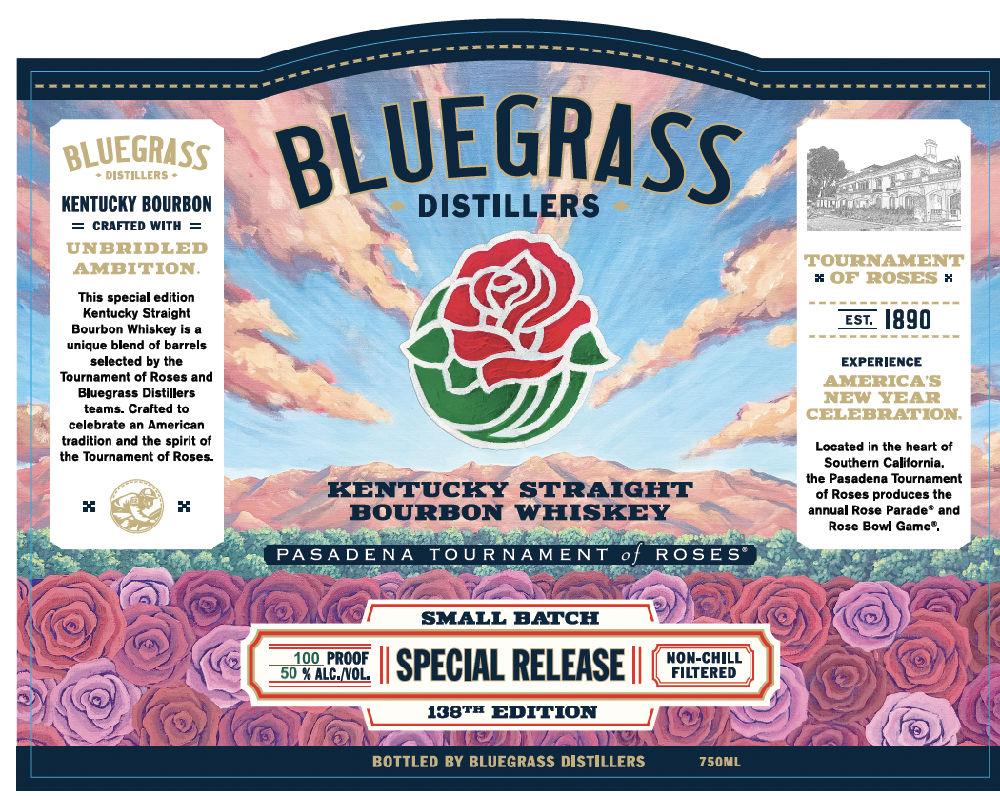

# TTB COLA Label Images - TTBID 26258001000469

**Brand Name:** BLUEGRASS DISTILLERS

**Issue Date:** 09/17/2026

**Origin Code:** 22

**Product Class/Type:** 101

**Source:** [TTB Public COLA Registry](https://ttbonline.gov/colasonline/viewColaDetails.do?action=publicFormDisplay&ttbid=26258001000469)

## Label Images

### Back Label

### Front Label

## Extracted Label Text

*Text extracted via OCR - may contain errors*

**Detected Age:** 6 Years

### Back Label

feos

LUEGR

BL

‘+ DISTILLERS +

BLUEGRASSDISTILLERS.COM

——o

{OVERNMENT WARNING:(1) ACCORDING TOTHE SURGEON

GENERAL, WOMEN SH

(GES DURING PRE

SGNANCY BECAUSI

ULD NOT DRINK ALCOHOLIC

_—

oe BIRTH DEFECTS. (2) C

INSUMPTION OF ALCOHOLIC

———— oe

TMPAIRS YOUR ABILITY T0 DRIVE A CAR OR

| —_____ 4

PEATE WACANENY DAY CAUSE EAC C'. —_—:

AGED FOR AT LEAST 6 YEARS

™

BOTTLED BY BLUEGRASS DISTILLERS - MIDWAY, KY

eee |

### Front Label

BLUEGRASS
distillers
BLUEGRASS
KENTUCKY BOURBON
DISTILLERS
CRAFTED WITH
UNBRIDLED
AMBITION:
TOURNAMENT
"OF ROSES
This special edition
Kentucky Straight
ESL
I890
Bourbon Whiskey Is
unique blend of barrels
selected by the
EXPERIENCE
Tournament of Roses and
AMERICAS
Bluegrass Distillers
NEU
TBAR
teams- Crafted to
CELEBRATION
celebrate an American
tradition and the spirit of
Located in the heart of
the Tournament of Roses
Southern California,
the Pasadena Tournament
KENTUCKY STRAIGHT
of Roses produces the
BOURBON
WHISKEY
annual Rose Parade" and
Rose Bowl Game
PA SADE NA
ToU R NAMENT
ROsES
SMALL BATCH
5o 98E005
SPECIAL RELEASE
NOLtCHILL
138TH EDITION
Ve
BOTTLED BY BLUEGRASS DISTILLERS
750ML
