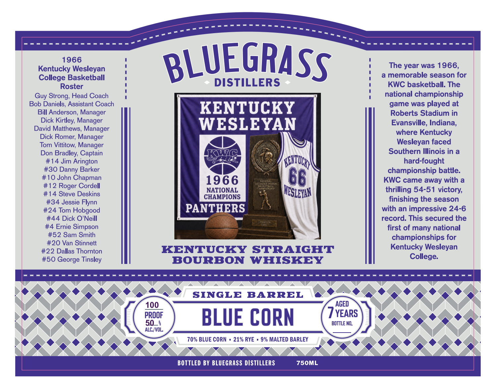

# TTB COLA Label Images - TTBID 26258001000472

**Brand Name:** BLUEGRASS DISTILLERS

**Issue Date:** 09/17/2026

**Origin Code:** 22

**Product Class/Type:** 101

**Source:** [TTB Public COLA Registry](https://ttbonline.gov/colasonline/viewColaDetails.do?action=publicFormDisplay&ttbid=26258001000472)

## Label Images

### Back Label

### Front Label

## Extracted Label Text

*Text extracted via OCR - may contain errors*

**Detected Age:** 6 Years

### Back Label

feos

LUEGR

BL

‘+ DISTILLERS +

BLUEGRASSDISTILLERS.COM

——o

{OVERNMENT WARNING:(1) ACCORDING TOTHE SURGEON

GENERAL, WOMEN SH

(GES DURING PRE

SGNANCY BECAUSI

ULD NOT DRINK ALCOHOLIC

_—

oe BIRTH DEFECTS. (2) C

INSUMPTION OF ALCOHOLIC

———— oe

TMPAIRS YOUR ABILITY T0 DRIVE A CAR OR

| —_____ 4

PEATE WACANENY DAY CAUSE EAC C'. —_—:

AGED FOR AT LEAST 6 YEARS

™

BOTTLED BY BLUEGRASS DISTILLERS - MIDWAY, KY

eee |

### Front Label

Kentuck9 6lesleyan
BLUEGRASS
The year was 1966,
College Basketball
memorable season for
Roster
DISTILLERS
KWC basketball: The
Strong; Head Coach
national championship
Bob Daniels, Assistant Coach
game was played at
Bill Anderson; Manager
KENTUCKY
Roberts Stadium in
Dick Kirtley; Manager
WESLEYAN
Evansville; Indiana;
David Matthews; Manager
where Kentucky
Dick Romer; Manager
Tom Vittitow; Manager
Wesleyan faced
Don
Bradley; Captain
KWZ
Southern Illinois in
#14 Jim
Arington
(Azuds L
hard-fought
#30
Barker
championship battle:
#10 John Chapman
1966
Hatior
KWC came away with a
#12
Roger Cordell
(coutsngus7so"
NATIONAL
thrilling 54-51 victory;
#14 Steve Deskins
CHAMPIONS
#34 Jessie Flynn
finishing the season
#24 Tom Hobgood
PANTHERS
with an impressive 24-6
#44 Dick 0 'Neill
record: This secured the
uamfidn
#4 Ernie Simpson
first of many national
#52 Sam Smith
championships for
#20 Van Stinnett
#22 Dallas Thornton
KENTUCKY
STRAIGHT
Kentucky Wesleyan
#50 George Tinsley
BOURBON
WHISKEY
College:
SINGLE
BARREL
100
AGED
B300F
BLUE CORN
BOTTLE
WFEARS
ALC /VOL
70% BLUE CORN
21% RYE
9% MALTED BARLEY
BOTTLED BY BLUEGRASS DISTILLERS
750ML
Guy
Danny
HESLeyan
