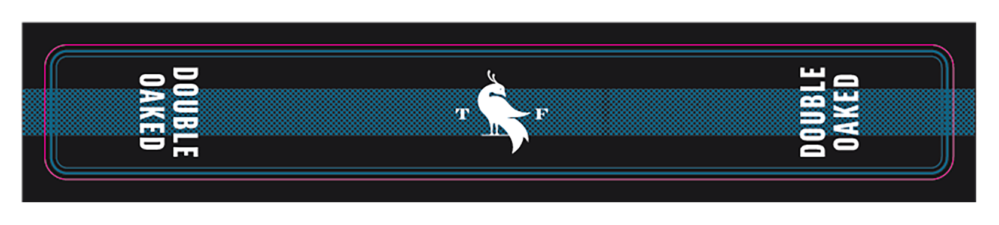
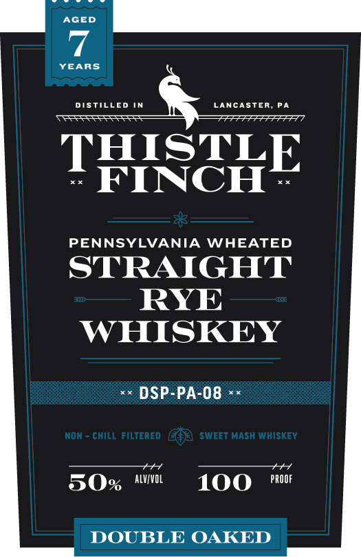

# TTB COLA Label Images - TTBID 26258001000597

**Brand Name:** THISTLE FINCH

**Issue Date:** 09/17/2026

**Origin Code:** 39

**Product Class/Type:** 102

**Source:** [TTB Public COLA Registry](https://ttbonline.gov/colasonline/viewColaDetails.do?action=publicFormDisplay&ttbid=26258001000597)

## Label Images

### Back Label

### Front Label

## Extracted Label Text

*Text extracted via OCR - may contain errors*

*1 image(s) excluded: text did not meet readability threshold*

**Detected Proof:** 100

### Front Label

AGED
YEARS
DISTillEd IN
LancASTER, PA
THISCHE
PENNSYLVANIA
WHEATED
STRAIGHT
RYE
WHISKEY
DSP-PA-08
NON
chill filtered
SweET MaSH WHISKEV
50%
ALVVOL
100
PROOF
DOUBLE OAKED
