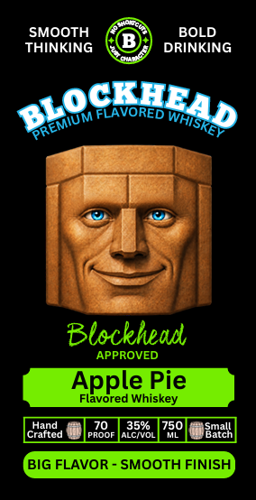

# TTB COLA Label Images - TTBID 26258001000613

**Brand Name:** BLOCKHEAD

**Fanciful Name:** APPLE PIE

**Issue Date:** 10/01/2026

**Origin Code:** 16

**Product Class/Type:** 149

**Source:** [TTB Public COLA Registry](https://ttbonline.gov/colasonline/viewColaDetails.do?action=publicFormDisplay&ttbid=26258001000613)

## Label Images

### Label 1

### Label 2

## Extracted Label Text

*Text extracted via OCR - may contain errors*

**Detected Proof:** 70

### Label 1

Drink Different
Drink Blockhead
GOVERNMENT
WARNING:
(1) According to the Surgeon General, women should
not drink alcoholic beverages during pregnancy
because of the risk of birth defects.
(2) Consumption of alcoholic beverages impairs your
ability to drive a car Or operate machinery,and may
cause health problems.
70
35%
750
colorEd WITH
ProOF
ALCNvOL
ML
CARAMEL
THe
Pott
0u $iiu0v
4
Fis
7uoia
Fruducedand Boulcd
Tla Point Dltilkry LLC  Ner Pest Bichey FL 24654
bi

### Label 2

SMOOTH
BOLD
THINKING
DRINKING
Blocvonedrhigd
FLAVORED
Blockhead
APPROVED
Apple Pie
Flavored Whiskey
Hand
35%
750
Sn2h
Craftcd
PROOF
ALCNOL
BIG FLAVOR
SMOOTH FINISH
PREMIUM
'WHISKEY
