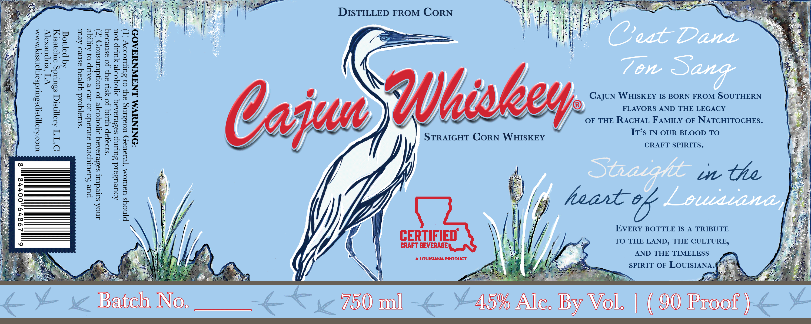

# TTB COLA Label Images - TTBID 26258001000679

**Brand Name:** CAJUN WHISKEY

**Issue Date:** 09/16/2026

**Origin Code:** 23

**Product Class/Type:** 103

**Source:** [TTB Public COLA Registry](https://ttbonline.gov/colasonline/viewColaDetails.do?action=publicFormDisplay&ttbid=26258001000679)

## Label Images

### Label 1

## Extracted Label Text

*Text extracted via OCR - may contain errors*

### Label 1

DISTILLED FROM CORN

Aq pomog
‘suratqoid yypeay osnvo Aeut

pue Krouryoeur oye10do 10 revo & aap 0} Aye

V7] ‘elipuexepy
Ino siredunt sasviorsq soyooye Jo uondumsuor (Z)

OTT Aroqnsiq ssurdg aryoresry

CajuN WHISKEY IS BORN FROM SOUTHERN
FLAVORS AND THE LEGACY
OF THE RACHAL FAMILY OF NATCHITOCHES.
It’s IN OUR BLOOD TO
CRAFT SPIRITS.

on Ue

woo<sa][MstpssuudsoryoyespEy MMM

‘s19JaP YI JO YSLI ay} JO asnvoaq

Aouvusoid SuLmMp sosevioAoq ooyoore Yup 10u
P[Noys udUIOM ‘TeraUay UOas.ing oy} 0} SuTpsod9y (T)

8

heute

EVERY BOTTLE IS A TRIBUTE

eo
CERTIFIED TO THE LAND, THE CULTURE,

CRAFT BEVERAGE
F a ; : Mt, : S AND THE TIMELESS
f I; . 1 ALOUISIANA PRODUCT , ;
q Was SPIRIT OF LOUISIANA. fs

a Oe x at, ahr pte a a le

Battela INO. 750ml 15% Ac. yy VO | ( OO root }

298479,00778

6
