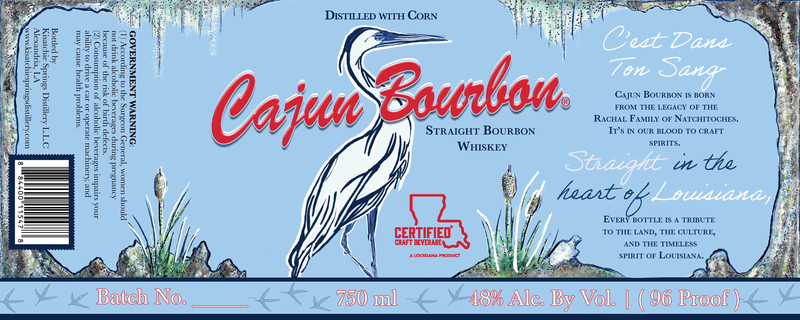

# TTB COLA Label Images - TTBID 26258001000687

**Brand Name:** CAJUN BOURBON

**Issue Date:** 09/16/2026

**Origin Code:** 23

**Product Class/Type:** 101

**Source:** [TTB Public COLA Registry](https://ttbonline.gov/colasonline/viewColaDetails.do?action=publicFormDisplay&ttbid=26258001000687)

## Label Images

### Label 1

## Extracted Label Text

*Text extracted via OCR - may contain errors*

### Label 1

DISTILLED WITH CORN

VI ‘eupuexo[y
Aq pomog

OTT Asoqnsiq ssurdg oryoresryy

CajUN BOURBON IS BORN
FROM THE LEGACY OF THE
RACHAL FAMILY OF NATCHITOCHES.
STRAIGHT BOURBON It’s IN OUR BLOOD TO CRAFT

WHISKEY Sa iUeIee

1 on Ce
]

EVERY BOTTLE IS A TRIBUTE
TO THE LAND, THE CULTURE,
AND THE TIMELESS

SPIRIT OF LOUISIANA. fa
nate = |

ES BNE

Bath Not TSO) soa ASM Nic. yy VOL | ( 06 root }

‘suraqqoid yyfeay osnvo Aeut

pue Krouryoeur aye10do 10 reo & aap 0} Aye
ino saredunt sasevioAsq soyooye Jo uondumsuor (Z)

fat,
a
2
=
°
2
3)
w
uc}
a.
=)
icie}
B
e
a.
eI
°
je}
E)

“ONINUVM LNANNYAAOD

*s19JIP YI JO YSLI ay} Jo asnvoaq

Aouvusoid SuLmMp sosevroAoq opoyoore Yup Jou
P[Noys usuIOM ‘TeraUIy UOasing dy} 0} SuTpsO.Vy (T)

8

27SLL),00778

8
