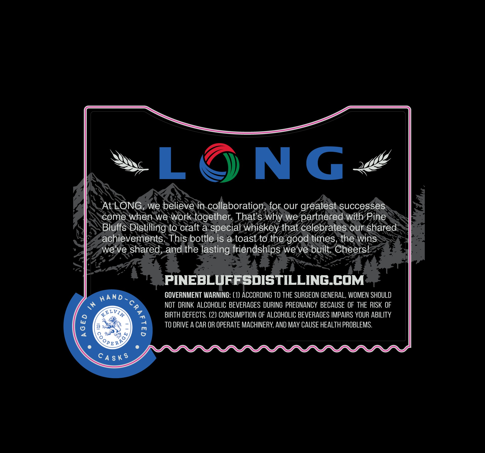
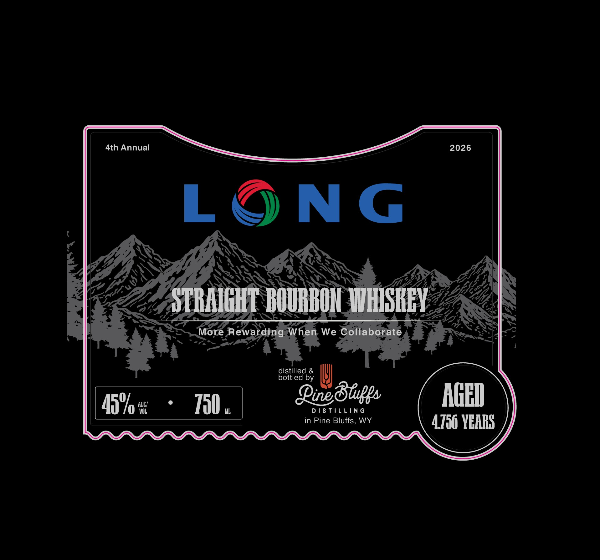

# TTB COLA Label Images - TTBID 26258001000702

**Brand Name:** PINE BLUFFS DISTILLING

**Fanciful Name:** LONG

**Issue Date:** 09/15/2026

**Origin Code:** 49

**Product Class/Type:** 101

**Source:** [TTB Public COLA Registry](https://ttbonline.gov/colasonline/viewColaDetails.do?action=publicFormDisplay&ttbid=26258001000702)

## Label Images

### Back Label

### Front Label

## Extracted Label Text

*Text extracted via OCR - may contain errors*

### Back Label

L
NG
At LONG; we believe in collaboration, for our greatest successes
come when we work
together That s why we partnered with Pine
Bluffs Distilling to craft a special whiskey that celebrates our shared
achievements: This bottle is a toast t0 the
times, the wins
we've shared; and the lasting friendships we've built Cheers!
PINEBLUFFsdISTILLING_COM
HAnD _
COVERNMENT WARNING: (1) ACCORDING TO THE SURGEON GENERAL, WOMEN SHOULD
4x
NOT DRINK ALCOHOLIC BEVERAGES DURING PREGNANCY BECAUSE OF THE RISK OF
4E1VAA
BIRTH DEFECTS. (2) CONSUMPTION OF ALCOHOLIC BEVERAGES IMPAIRS YOUR ABILITY
8
8
TO DRIVE A CAR OR OPERATE MACHINERY, AND MAY CAUSE HEALTH PROBLEMS.
CA $ K $
good
:
RAG)
'OPE

### Front Label

4th Annual 2026
C &
¢ a
: Y, NS yx S SEK Sh
Pe] TAILS, OOD NCI Dap AT Ww WEY ZZ, Pe
VeZ Jae A DOU HUN WOME TS
aE ty tet ed ZEN
rae 4. 3 More Ret arding-When We Coli bora ny pe a
& a; esi ae 4 ae es . nat 1
aaies (l)
a Aha
Bede (MM
40/0 100. ine blite WY 4756 YEARS
