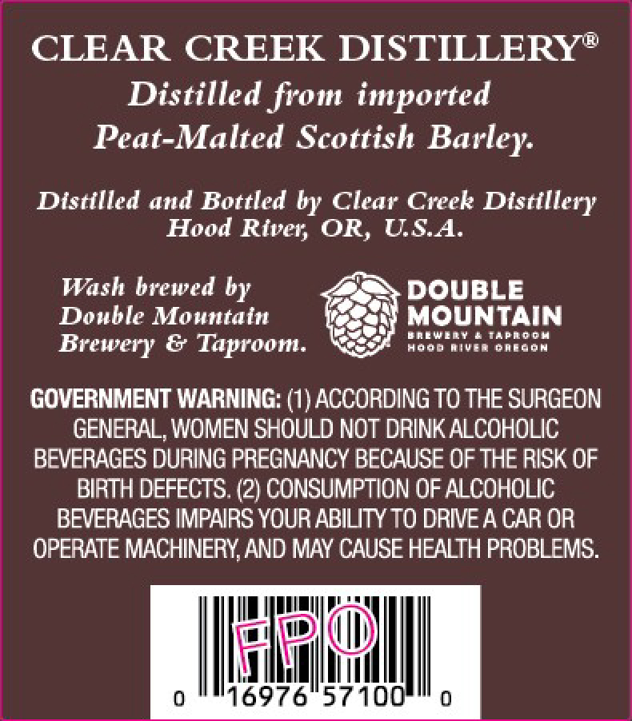
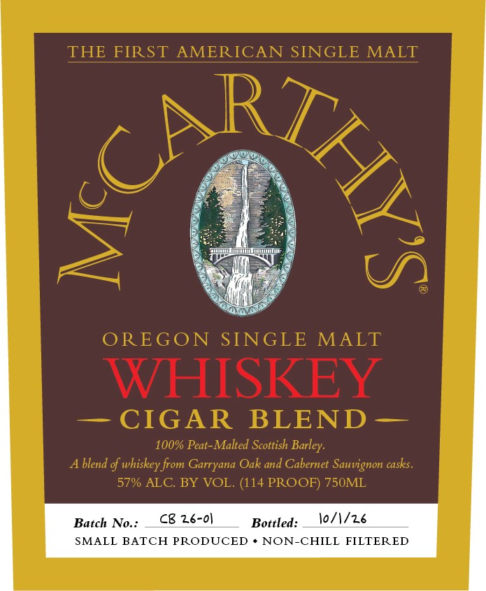

# TTB COLA Label Images - TTBID 26258001000732

**Brand Name:** MCCARTHY'S

**Issue Date:** 09/28/2026

**Origin Code:** 38

**Product Class/Type:** 118

**Source:** [TTB Public COLA Registry](https://ttbonline.gov/colasonline/viewColaDetails.do?action=publicFormDisplay&ttbid=26258001000732)

## Label Images

### Back Label

### Front Label

## Extracted Label Text

*Text extracted via OCR - may contain errors*

**Detected Proof:** 114

### Back Label

CLEAR CREEK DISTILLERY"
Distilled from imported
Peat-Malted Scottish
Distilled and Bottled by Clear Creek Distillery
Hood River; OR, USA
Wash brewed by
DOUBLE
Double Mountatn
MOUNTAIN
WnewllY
0 #pdoh
Brewery & Taproom:
4ojd
mivro Baeoon
GOVERNMENT WARNING: (1) ACCORDING TO THE SURGEON
GENERAL, WOMEN SHOULd NoT DRINK ALCOHOLIC
BEVERAGES DURING PREGNANCY BECAUSE OF THE RISK OF
BIRTH DEFECTS: (2) CONSUMPTION OF ALCOHOLIC
BEVERAGES IMPAIRS YOUR ABILITY TO DRIVEA CAR OR
OPERATE MACHINERY,AND MAY CAUSE HEALTH PROBLEMS:
0
16976"57100
Barley:

### Front Label

THE FIRST
AMERICAN SINGLE MALT
404
OREGON SINGLE MALT
WHISKEY
CIGAR
BLEND
100% Peat-Malted Scottish Barley:
blend of whiskey from Garryana Oak and Cabernet Sauvignon casks.
57% ALC BY VOL. (114 PROOF) 750ML
Batch
No:-
Cb 26-01
Bottled:
lo/1/z6
SMALL BATCH PRODUCED
NON-CHILL FILTERED
