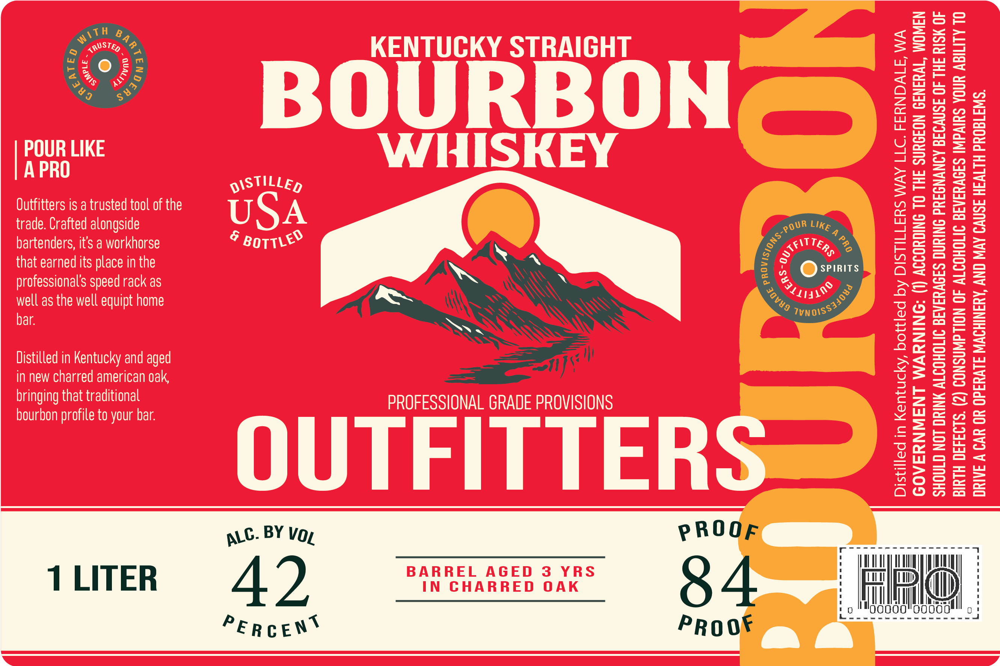

# TTB COLA Label Images - TTBID 26258001000764

**Brand Name:** OUTFITTERS

**Issue Date:** 09/18/2026

**Origin Code:** 07

**Product Class/Type:** 101

**Source:** [TTB Public COLA Registry](https://ttbonline.gov/colasonline/viewColaDetails.do?action=publicFormDisplay&ttbid=26258001000764)

## Label Images

### Label 1

## Extracted Label Text

*Text extracted via OCR - may contain errors*

**Detected Age:** 3 Years

### Label 1

52
^
austeB 4 ,,
KENTUCKY STRAIGHT
<
888
{
Y3
^
3
BOUERONZ
18
3
2
POUR LIKE
WHISKEY
9
8ilg
A PRO
DISTILLED
24
H
Outfitters is a trusted tool of the
USA
2
trade Crafted alongside
3
bartenders; its & workhorse
6
Ih
2
that earned its place in the
SPIRITS
professionals speed rack as
2=
2
well as the well equipt home
1
8
bar
3
1
=
0
Distilled in Kentucky and aged
96
in new charred american oak
1
bringing that traditional
PROFESSIONAL GRADE PROVISIONS
0
3
3
bourbon
to your bar
8
OUTFITTERS
2
1
=
L
3
06
3
I7
BY
PROOF
BARREL
AGED
3
YRS
LITER
42
IN
CHARRED
0 AK
84
PE R C ENT
PRO 0F
TTH
)
{
S 4
(
LIKE
BOTTLED
3
4FTTERs
3
"111s,$
'VNOISS340">
1
~
profile
VOL
ALC.
