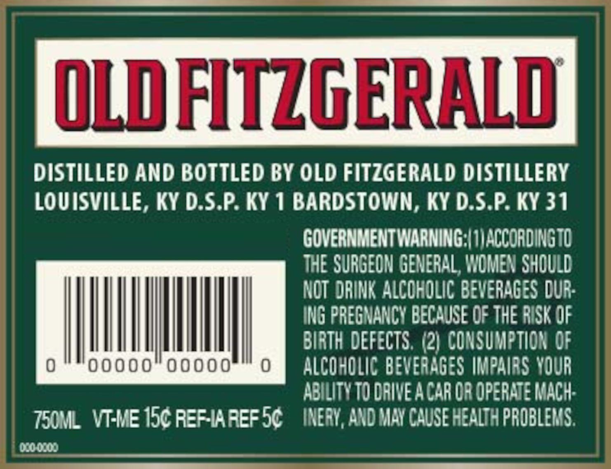
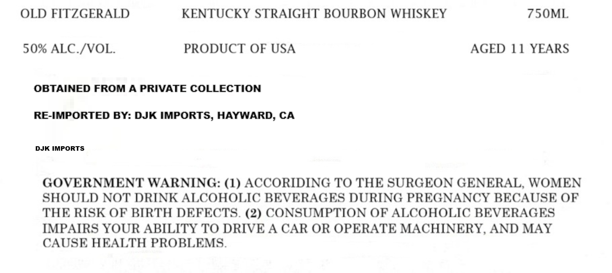
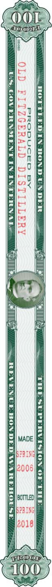

# TTB COLA Label Images - TTBID 26259001000018

**Brand Name:** DJK IMPORTS

**Issue Date:** 09/17/2026

**Origin Code:** 00

**Product Class/Type:** 111

**Source:** [TTB Public COLA Registry](https://ttbonline.gov/colasonline/viewColaDetails.do?action=publicFormDisplay&ttbid=26259001000018)

## Label Images

### Back Label

### Label 1

### Label 3

### Label 4

## Extracted Label Text

*Text extracted via OCR - may contain errors*

*1 image(s) excluded: text did not meet readability threshold*

**Detected Proof:** 100
**Detected Age:** 11 Years

### Back Label

OLD FITZGERALD

DISTILLED AND BOTTLED BY OLD FITZGERALD DISTILLERY

LOUISVILLE, KY D.S.P. KY 1 BARDSTOWN, KY D.S.P. KY 31

GOVERNMENT WARNING:| 1) ACCORDING TO

THE SURGEON GENERAL, WOMEN SHOULD

NOT DRINK ALCOHOLIC BEVERAGES DUR

ING PREGNANCY BECAUSE OF THE RISK OF

BIRTH DEFECTS, (2) CONSUMPTION OF

MIMI,

ALCOHOLIC BEVERAGES IMPAIRS YOUR

ABILITY TO DRIVE ACAR OR OPERATE MACH

T50ML VT-ME 15¢ REF-IAREFS¢ — INERY, AND MAY CAUSE HEALTH PROBLEMS

000-0200

### Label 1

OLD FITZGERALD
KENTUCKY STRAIGHT BOURBON WHISKEY
75OML
50% ALC /VOL
PRODUCT OF USA
AGED 11 YEARS
OBTAINED FROM A PRIVATE COLLECTION
RE-IMPORTED BY: DJK IMPORTS, HAYWARD; CA
DJK IMPORTS
GOVERNMENT WARNING: (1) ACCORIDING TO THE SURGEON GENERAL, WOMEN
SHOULD NOT DRINK ALCOHOLIC BEVERAGES DURING PREGNANCY BECAUSE OF
THE RISK OF BIRTH DEFECTS. (2) CONSUMPTION OF ALCOHOLIC BEVERAGES
IMPAIRS YOUR ABILITY TO DRIVE A CAR OR OPERATE MACHINERY, AND MAY
CAUSE HEALTH PROBLEMS

### Label 3

ROPE LED IN BOND UNDER

PRODUCED BY

LeS. GOVERNMENT IN INTERNALS
