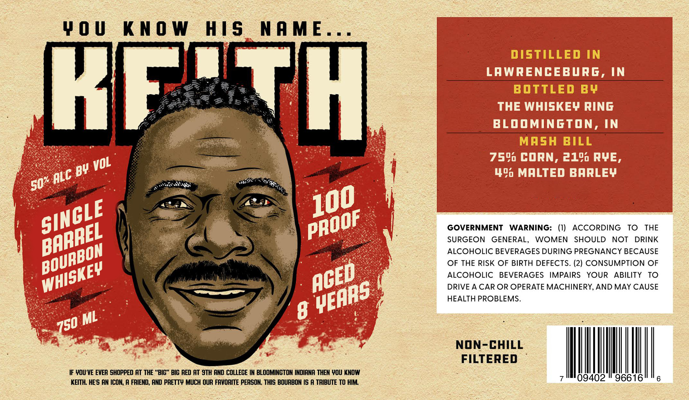

# TTB COLA Label Images - TTBID 26259001000047

**Brand Name:** KEITH SINGLE BARREL

**Issue Date:** 09/17/2026

**Origin Code:** 19

**Product Class/Type:** 141

**Source:** [TTB Public COLA Registry](https://ttbonline.gov/colasonline/viewColaDetails.do?action=publicFormDisplay&ttbid=26259001000047)

## Label Images

### Label 1

## Extracted Label Text

*Text extracted via OCR - may contain errors*

**Detected Proof:** 100

### Label 1

W 0 U
KnO W
HIS
NAME=
DISTILLED IN
LAWRENCEBURG, IN
BOTTLED BY
8 > ?5&
THE WHISKEY RING
BLOOMINGTON, IN
MASH
BILL
759p CORN, 2140 RYE,
BV
44 MALTED BARLEY
GOVERNMENT
WARNING:
(I)
ACCORDING
To
THE
SURGEON
GENERAL,
WOMEN
SHOULD
NOT
DRINK
ALCOHOLIC BEVERAGES DURING PREGNANCY BECAUSE
OF THE RISK OF BIRTH DEFECTS. (2) CONSUMPTION OF
ALCOHOLIC
BEVERAGES
IMPAIRS
YOUR
ABILITY
TO
DRIVE A CAR OR OPERATE MACHINERY, AND MAY CAUSE
HEALTH PROBLEMS.
ML
8
NON-CHILL
FILTERED
IF WOU VE EVER SHOPPED AT THE "BIG" BIG RED AT 9TH AND COLLEGE IN BLOOMINGTON INDIANA THEN WOU KNOW
KEITH: HES AM ICOM,A FRIEND, AND PRETTY MUCH OUR FAVORITE PERSON . THIS BOURBON IS A TRIBUTE TO HIM
09402
96616
6
M
T7
VOL
ALC
50%
100
SINCLE
PROOF
BARREL
BOURBON
WHISKEY
ACED
YEARS
750
