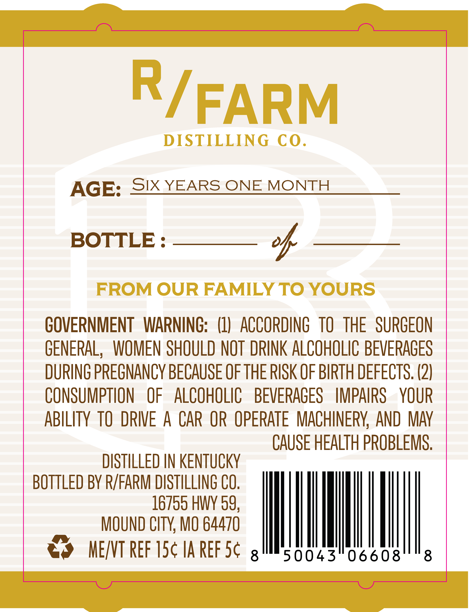
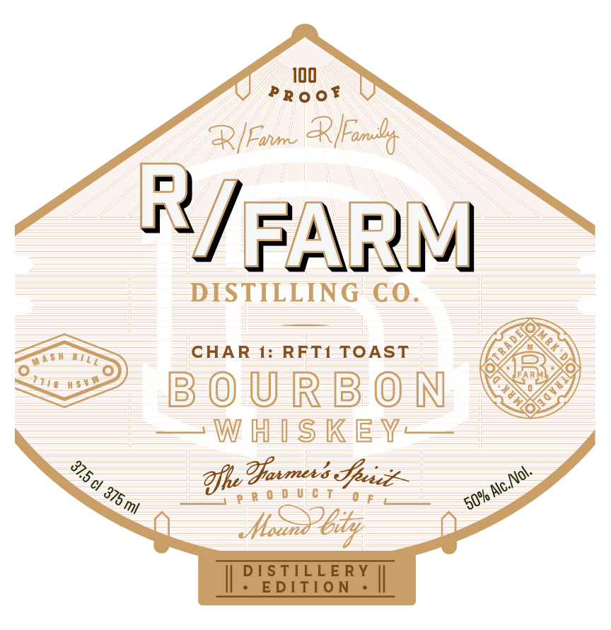

# TTB COLA Label Images - TTBID 26259001000064

**Brand Name:** R/FARM DISTILLING CO.

**Issue Date:** 09/24/2026

**Origin Code:** 29

**Product Class/Type:** 141

**Source:** [TTB Public COLA Registry](https://ttbonline.gov/colasonline/viewColaDetails.do?action=publicFormDisplay&ttbid=26259001000064)

## Label Images

### Back Label

### Front Label

## Extracted Label Text

*Text extracted via OCR - may contain errors*

### Back Label

FARM
DISTILLING
Co.
AGE:
Six YEARS ONE
MONTH
BOTTLE :
o4
FROM OUR FAMILY TO YOURS
GOVERNMENT   WARNING:   (11
ACCORDING   TO
THE   SURGEON
GENERAL,  WOMEN SHOULD NOT DRINK ALCOHOLIC BEVERAGES
DURING PRECNANCY BECAUSE OF THE RISK OF BIRTH DEFECTS. (2)
CONSUMPTION
OF
ALCOHOLIC
BEVERAGES
IMPAIRS
YOUR
ABILITY TO  DRIVE A CAR OR OpERATe   MACHINERY  AND MAY
CAUSE HEALTH PROBLEMS,
DISTILLED IN KENTUCKY
BOTTLED BY R/FARM DISTILLING CO.
16755 HWY 59,
MOUND CTY, MO 64470
MEXVT Ref ISc IA REF Sc
8
50043"06608
8
Ry"

### Front Label

Alou
R[Farm Rian
J PANN
NSE EIT CHAR 1: == TOAST FERN
<> sounson ©)
—W HISKE ¥—
25, Dy She Torreti Goce = wo
NO Mosby
