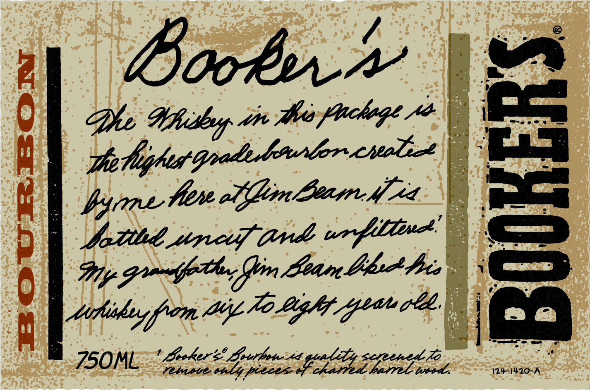
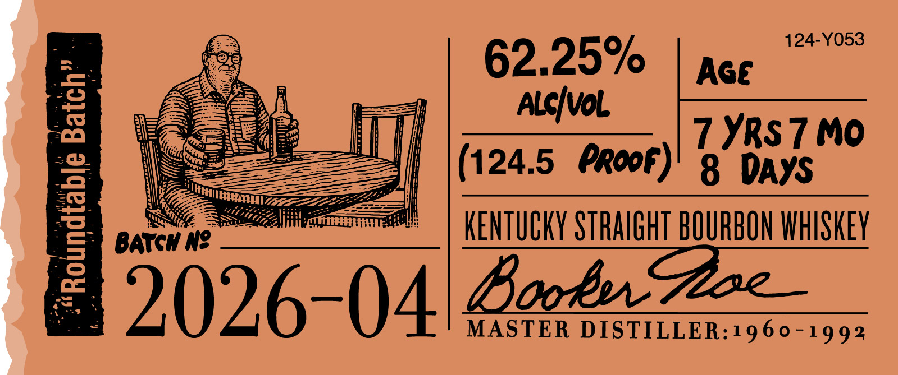
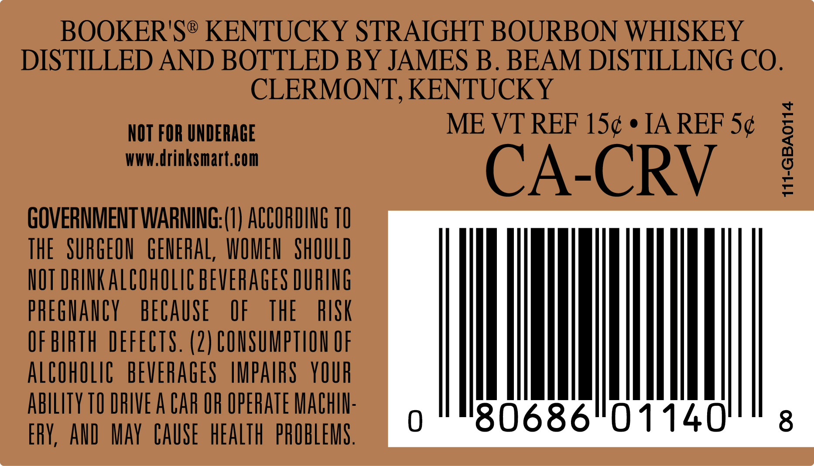
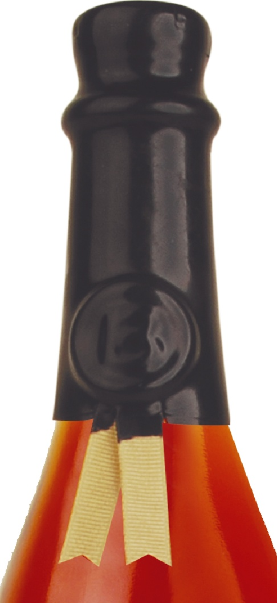

# TTB COLA Label Images - TTBID 26259001000138

**Brand Name:** BOOKER'S

**Issue Date:** 09/17/2026

**Origin Code:** 22

**Product Class/Type:** 101

**Source:** [TTB Public COLA Registry](https://ttbonline.gov/colasonline/viewColaDetails.do?action=publicFormDisplay&ttbid=26259001000138)

## Label Images

### Label 1

### Label 2

### Label 3

### Label 4

## Extracted Label Text

*Text extracted via OCR - may contain errors*

*1 image(s) excluded: text did not meet readability threshold*

**Detected Proof:** 124.5
**Detected Age:** 7 Years

### Label 1

Boob

De Whiithyy ste thes plochege 0

—_

polighes

one Hire offlim Learn ifr

pica

Sotihd wipers (rds un f Line

Gy gmt, in Lean bh heis

Mtiihiy from Ai 70 Ligh Geen

=<

aE Sse

### Label 2

124-Y053
62.25%
Age
3
AlcIvol
7 YRs 7 Mo
124.5 Propf)
8
DAYS
1
BATGH N?
KENTuCKY STRAIGHT BOURBON WHISKEY
2026-04/Bon 223
MASTER
DISTILLER:1960-1992

### Label 3

BOOKER'S® KENTUCKY STRAIGHT BOURBON WHISKEY

DISTILLED AND BOTTLED BY JAMES B. BEAM DISTILLING CO.

CLERMONT, KENTUCKY

NOT FOR UNDERAGE

ME VT REF 15¢ ¢ IA REF 5¢

WWW.drinksmart.com

CA-CRV

GOVERNMENT WARNING:(1) ACCORDING 10

meme weenie

THE SURGEON GENERAL, WOMEN SHOULD

NOT DRINK ALCOHOLIC BEVERAGES DURING

PREGNANCY BECAUSE OF THE

RISK

OF BIRTH DEFECTS. (2) CONSUMPTION OF

ALCOHOLIC BEVERAGES IMPAIRS YOUR

ABILITY TO DRIVE A CAR OF OPERATE MACHIN

ERY, AND MAY CAUSE HEALTH PROBLEMS
