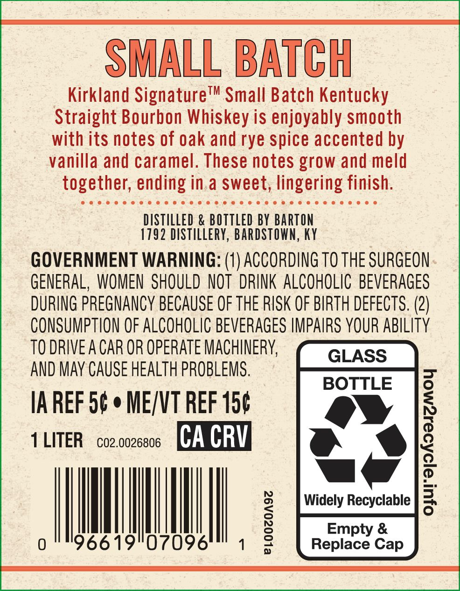
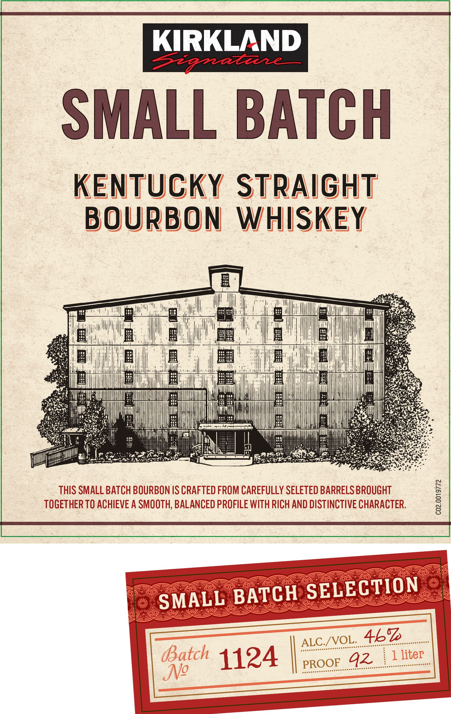
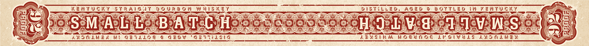

# TTB COLA Label Images - TTBID 26259001000164

**Brand Name:** KIRKLAND SIGNATURE

**Fanciful Name:** SMALL BATCH

**Issue Date:** 09/17/2026

**Origin Code:** 22

**Product Class/Type:** 101

**Source:** [TTB Public COLA Registry](https://ttbonline.gov/colasonline/viewColaDetails.do?action=publicFormDisplay&ttbid=26259001000164)

## Label Images

### Back Label

### Front Label

### Label 3

## Extracted Label Text

*Text extracted via OCR - may contain errors*

### Back Label

SMALL BATCH
Kirkland SignatureTm Small Batch Kentucky
Straight Bourbon Whiskey is enjoyably smooth
with its notes of oak and rye spice accented by
vanilla and caramel: These notes grow and meld
together; ending in a sweet; lingering finish.
DSTILLED & BOTTLED BY BARTON
1792 Distillery; BARDSTOWN, Ky
GOVERNMENT WARNING: (1) ACCORDING TO THE SURGEON
GENERAL, WOMEN  SHOULD NOT  DRINK ALCOHOLIC BEVERAGES
DURING PREGNANCY BECAUSE OF THE RISK OF BIRTH DEFECTS. (2)
CONSUMPTLON OF ALCOHOLIC BEVERAGeS IMPAIRS YOUR ABILITY
TO DRIVE A CAR OR OPERATE MACHINERY
GLASS
AND MaY Cause HEALTH PROBLEMS .
BOTTLE
IA REF 5c
ME/NT REF 150
1
LITER
CO2.0026806
CA CRV
|
Widely Recyclable
0
96619"07096
1
1
Repiaoe &
Cap

### Front Label

KIRKLAND
Sapa7ee
SMALL BATCH
KENTUCKY
STRAigHT
BOURBON
WHISKEY
@
@
B
THIS SMALL BATCH BOURBON IS CRAFTED FROM CAREFULLY SELETED BARRELS BROUGHT
1
TOGETHER TO ACHIEVE A SMOOTH; BALANCED PROFILE WITH RICH AND DISTINCTIVE CHARACTER.
8
SMALL BATCH SELECTION
ALC /oL_4kz
Batch 1124
PROOE_42
1 liter
JNo

### Label 3

EC) KENTUCKY STRAIGIT BOURBON WHISKET. SaaS — DISTILLED, AGED 8 BOTTLED IN KENTUCKY ln
is « D RES es, Ee Pres i aes = Tr SSS "ye s See a eee eo ee See ee. CP ee FQEDELA <3 a8 q ‘we + 1)
HE ag heros PAs la BeALcOiH aeons My ori v acre | Us NeSend ate |
Se) ee

gs AMOVLNEL WE OF1A19G € GEOW GETTASIG oeahes 2EVSIRM NOGUAOS LUSIVULS AMOMKNEY ba gS?
