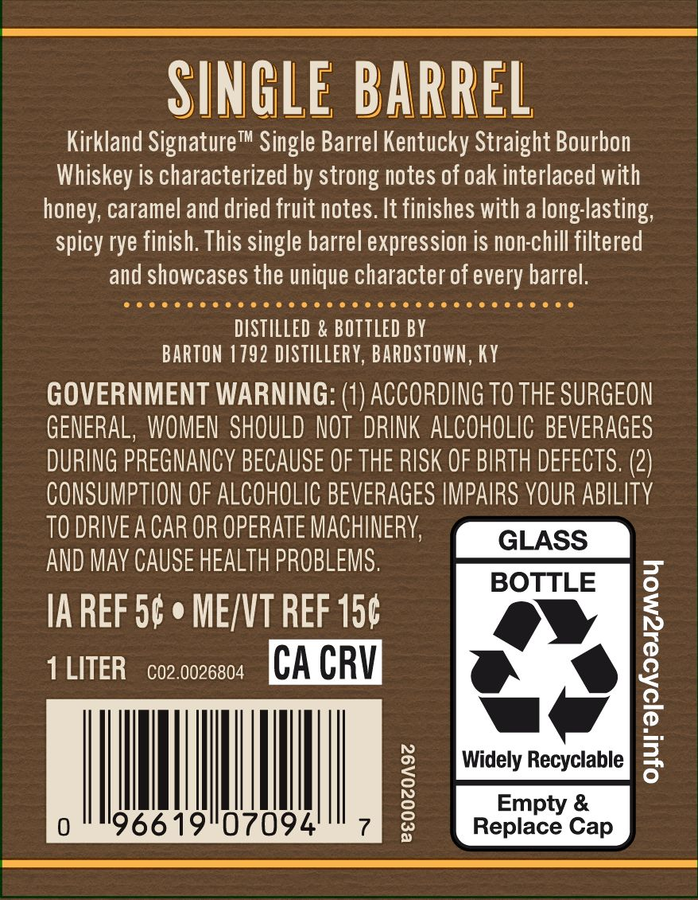
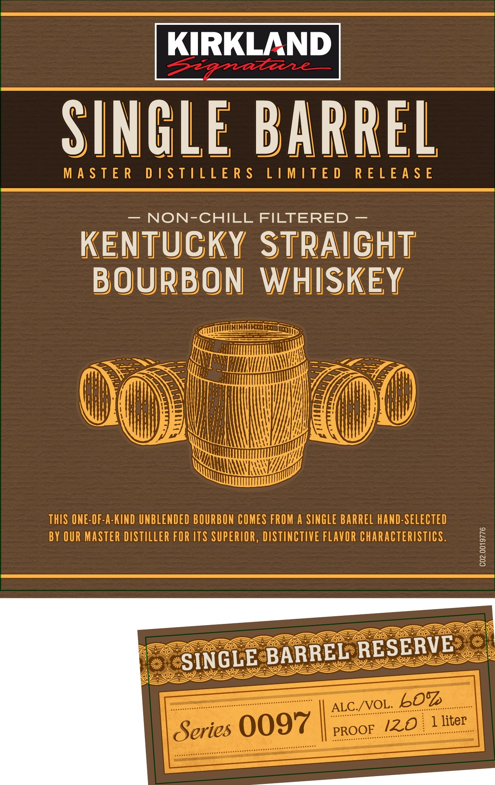
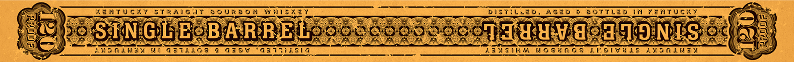

# TTB COLA Label Images - TTBID 26259001000187

**Brand Name:** KIRKLAND SIGNATURE

**Fanciful Name:** SINGLE BARREL

**Issue Date:** 09/17/2026

**Origin Code:** 22

**Product Class/Type:** 101

**Source:** [TTB Public COLA Registry](https://ttbonline.gov/colasonline/viewColaDetails.do?action=publicFormDisplay&ttbid=26259001000187)

## Label Images

### Back Label

### Front Label

### Label 3

## Extracted Label Text

*Text extracted via OCR - may contain errors*

### Back Label

SINGLE BARREL
Kirkland Signature'
TM
Single Barrel Kentucky Straight Bourbon
Whiskey is characterized by strong notes of oak interlaced
honey; caramel and dried fruit notes. It finishes with a long-lasting;
spicy rye finish: This single barrel expression is non-chill filtered
and showcases the unique character of every barrel.
DISTILLED
BOTTLED BY
BARTON 1792 DISTILLERY, BARDSTOWN , KY
GOVERNMENT WARNING:
ACCORDING TO THE SURGEON
GENERAL, WOMEN  SHOULD NOT  DRINK ALCOHOLIC BEVERAGES
DURING PREGNANCY BECAUSE OF THE RISK OF BIRTH DEFECTS. (2)
CONSUMPTION OF ALCOHOLIC BEVERAGES IMPAIRS YOUR ABILITY
TO DRIVEA CAR OR OPERATE MACHINERV
GLASS
AND May CAUSE HEALTH PROBLEMS.
BOTTLE
IA REF 50
MEJVT REF 150
1 LITER
CO2.0026804
CA CRV
|
Widely Recyclable
0
196619"07094
1
Replacty Cap
with

### Front Label

KIRKLAND
2142
SINGLE BARREL
M A S T E R
D | S TILL E R $
L IMITE D
R E L E A $ E
NON-CHILL FILTERED
KENTUCKY STRAighT
BOURBON
WHISKEY
ThIS ONE-OF-A-KIND UNBLENDED BOURBON COMES FROM A SINGLE BARREL HAND-SELECTED
BY OUR MASTER DISTILLER FOR ITS SUPERIOR , DISTINCTIVE FLAVOR characteristics.
0
8
SINGLE BARREL RESERVE
ALC /VOL_6OZ
Series 0097
PROQF
1 liter
120

### Label 3

6 KENTUCKY STRAIG IT BOURBON WHISKEY. TES _bistitwep, AGED @ BOTTLED IN VENTUGKY ae

feng) Ea On ee

SW poSTNGUEOBAR RE Los sno co yocol TH uW. ded ONES io3 ane

fe lace! 2 ee re ws et Se SASSER Rebtel WIE ‘O:N Sisk ‘ ae
\ AMoLWEy NU GEIL;Og € G20V “Gaiiiasia Cae ZENSINM NOGUNOA LEOIWHES AMONLNEY
