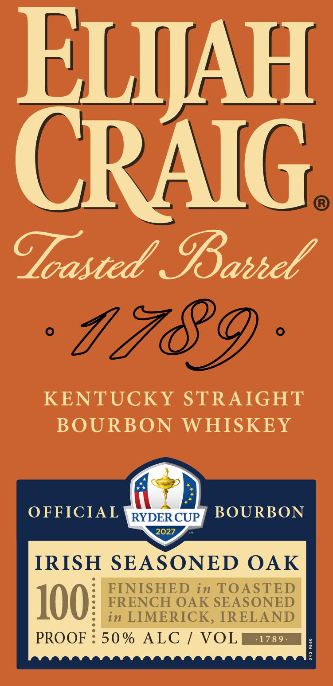
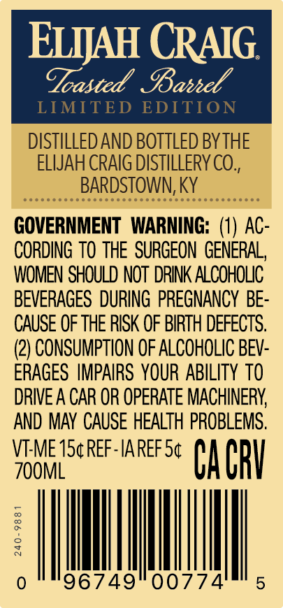
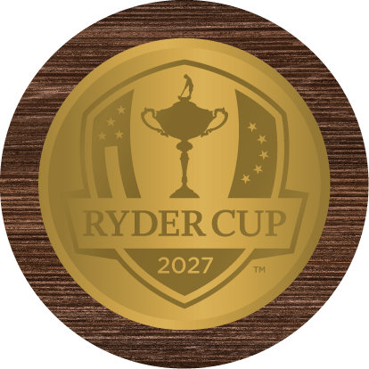

# TTB COLA Label Images - TTBID 26259001000273

**Brand Name:** ELIJAH CRAIG

**Fanciful Name:** RYDER CUP LIMITED EDITION

**Issue Date:** 09/17/2026

**Origin Code:** 22

**Product Class/Type:** 101

**Source:** [TTB Public COLA Registry](https://ttbonline.gov/colasonline/viewColaDetails.do?action=publicFormDisplay&ttbid=26259001000273)

## Label Images

### Label 1

### Label 2

### Label 3

### Label 4

## Extracted Label Text

*Text extracted via OCR - may contain errors*

*2 image(s) excluded: text did not meet readability threshold*

**Detected Proof:** 100

### Label 1

ELIJAH
CRAIG
Goasted' Ianhel
7789
KENTUCKY
STRAIGHT
BOURBON
WHISKEY
OFFICIAL
RYDER CUP
BOURBON
2027
IRISH
SEASONED
OAK
FINISHED in TOASTED
100
FRENCH OAK SEASONED
in LIMERICK, IRELAND
PROOF
50 % ALC
VOL
178 9
1

### Label 2

ELIJAH CRAIG.

Leasted Barrel

LIMITED EDITION

DISTILLED AND BOTTLED BY THE
ELIJAH CRAIG DISTILLERY CO.,
BARDSTOWN, KY

GOVERNMENT WARNING: (1) AC-
CORDING TO THE SURGEON GENERAL,
WOMEN SHOULD NOT DRINK ALCOHOLIC
BEVERAGES DURING PREGNANCY BE-
CAUSE OF THE RISK OF BIRTH DEFECTS.
(2) CONSUMPTION OF ALCOHOLIC BEV-
ERAGES IMPAIRS YOUR ABILITY TO
DRIVE A CAR OR OPERATE MACHINERY,
AND MAY CAUSE HEALTH PROBLEMS.

wt Aas IAREF 5¢ T CRY

240-9881

0
