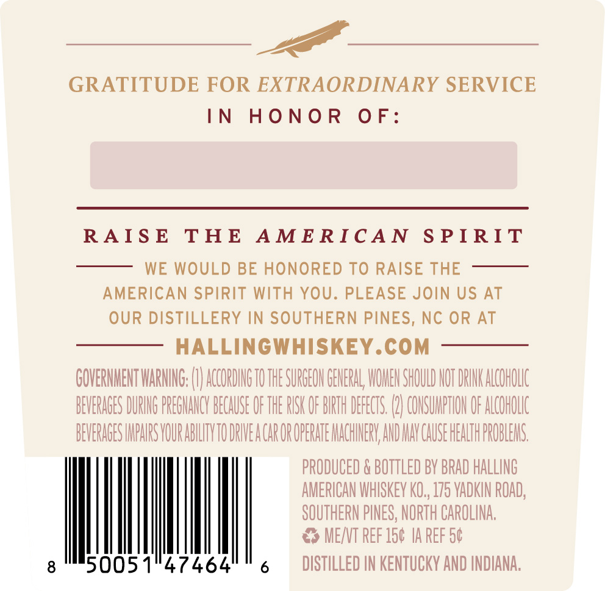
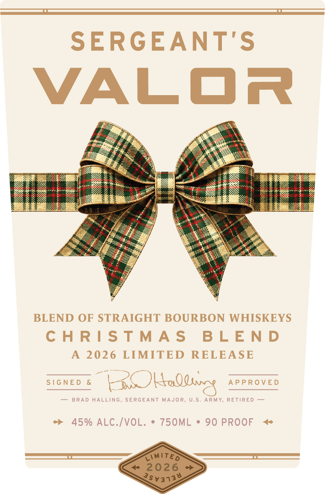
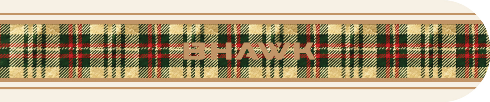

# TTB COLA Label Images - TTBID 26259001000319

**Brand Name:** SERGEANT'S VALOR

**Issue Date:** 09/17/2026

**Origin Code:** 35

**Product Class/Type:** 121

**Source:** [TTB Public COLA Registry](https://ttbonline.gov/colasonline/viewColaDetails.do?action=publicFormDisplay&ttbid=26259001000319)

## Label Images

### Back Label

### Front Label

### Label 3

## Extracted Label Text

*Text extracted via OCR - may contain errors*

*2 image(s) excluded: text did not meet readability threshold*

### Back Label

GRATITUDE FOR EXTRAORDINARY SERVICE
IN
HO N0 R
0 F:
RA IS E
THE
A M E RIC A N
S P I RIT
WE WOULD BE HONORED TO RAISE THE
AMERICAN SPIRIT WITH YOU. PLEASE JOIN US AT
OUR DISTILLERY IN SOUTHERN PINES, NC OR AT
HALLINGWHISKEY.COM
GOVERHHENT WARHNG; (€ AccORDHgTO THE SURGEOH GEHERAL WOHEH SHOULD HOT DRHK ALCOHOLC
BEVERAGES DURIHG PREGHANCY BECAUSE OF THE RSK OF BURTH DEFECTS
COHSUMPTHOH OF ALCOHOLLC
BEVERAGES HPHRS VOURABILHTYTO DRIEA CAR OR OPERATE HACHHHERV AHD HAY CAUSE HEALTH PROBLEHS
PRODUCED & BOTTLED BV BRAD HALLING
AMERICAN WHSKEV KO,, 175 VADKIN ROAD;
SOUTHERN PINES, NORTH CAROLINA,
MENNT REF 150 IA REF 50
8
50051"47464
DISTILLED IN KENTUCKY AND INDIANA,
