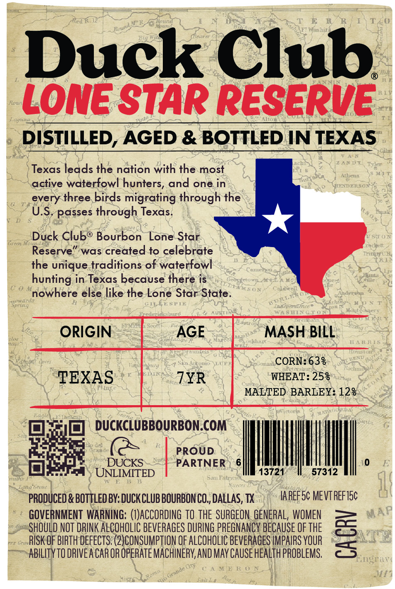
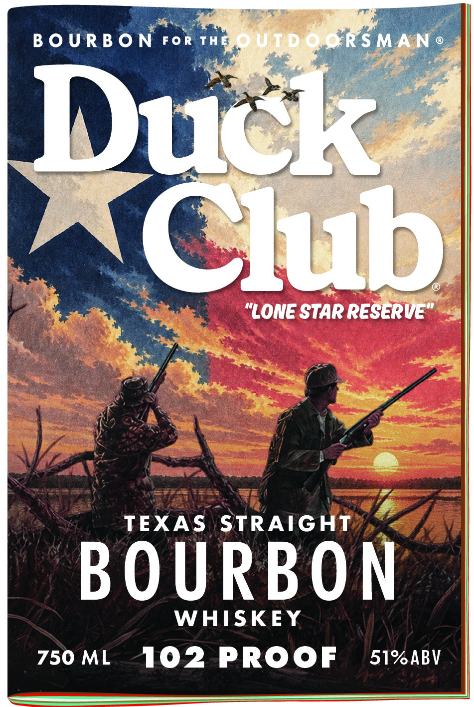

# TTB COLA Label Images - TTBID 26259001000361

**Brand Name:** DUCK CLUB

**Issue Date:** 09/17/2026

**Origin Code:** 44

**Product Class/Type:** 101

**Source:** [TTB Public COLA Registry](https://ttbonline.gov/colasonline/viewColaDetails.do?action=publicFormDisplay&ttbid=26259001000361)

## Label Images

### Back Label

### Front Label

### Label 3

## Extracted Label Text

*Text extracted via OCR - may contain errors*

*1 image(s) excluded: text did not meet readability threshold*

**Detected Proof:** 102
**Detected Age:** 7 Years

### Back Label

Duck Club
Lone StaR ReseRve
DISTILLED, AGED & BOTTLED IN TEXAS
Texas leads the nation with the most
active waterfowl hunters, and one in
every three birds migrating through the
U.S. passes through Texas.
Duck Clubo Bourbon
Lone Star
Reserve
was
to celebrate
the unique traditions of waterfowl
hunting in Texas because there is
nowhere else like the Lone Star State
E E FTE
ORIGIN
AGE
MASH BILL
W I R
CORN: 638
TEXAS
7YR
WHEAT: 253
MALTED BARLEY: 128
DUCKCLUBBOURBON.COM
PROUD
DUCKS
PARTNER
UNLIMTED
13721
57312
San Fallrie
PRODUCED & BOTTLED BY: DUCKCLUB BOURBON CO  DALLAS, TX
IA REFSc MEVT REFISc
GOVERNMENT  WARNING; (I)ACCORDING TO the SURGEON GENERAL,  WOMEN
SHOULD NOT DRINK ALCOHOLIC BEVERAGES DURING PREGNANCY BECAUSE OF THE
RISK OF BIRTH deFECTS; (2)CONSUMPTLON OF ALCOHOLIC BEVERAGES IMPAIRS VOUR
3
AbIliTyTO DRIVEA CAR OR OpeRATe MACHINERY, AND May Cause heaLTh PROBLEMS
ST{
created

### Front Label

B 0 U R B 0 N
FoR Thb
0UTdoorsMAN
Reitbl
"LoNe StAR ReseRvE"
TEXAS
STRAIGHT
BOURBON
WHISKEY
750 ML
102
PROOF
51%ABV
