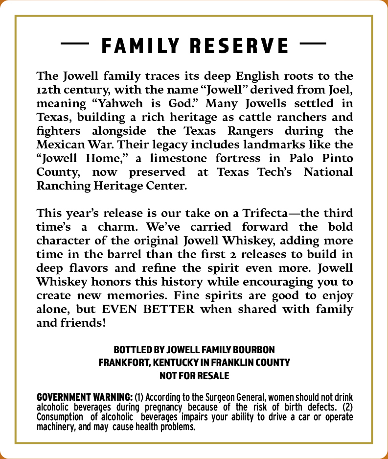

# TTB COLA Label Images - TTBID 26259001000390

**Brand Name:** JOWELL FAMILY RESERVE

**Issue Date:** 09/24/2026

**Origin Code:** 22

**Product Class/Type:** 101

**Source:** [TTB Public COLA Registry](https://ttbonline.gov/colasonline/viewColaDetails.do?action=publicFormDisplay&ttbid=26259001000390)

## Label Images

### Back Label

### Front Label

## Extracted Label Text

*Text extracted via OCR - may contain errors*

*1 image(s) excluded: text did not meet readability threshold*

### Back Label

FAMILY RESERVE
The Jowell family traces its deep English roots to the
Izth century with the name  Jowell" derived from Joel,
meaning "Yahweh
is
God" Many   Jowells
settled
in
Texas, building
a rich
heritage as cattle ranchers and
fighters
alongside
the
Texas
Rangers
during
the
Mexican War: Their legacy includes landmarks like the
(Jowell
Home;
limestone
fortress
in
Palo
Pinto
County;
now
preserved
at
Texas
Techs
National
Ranching Heritage Center:
This years release is our take on
Trifecta--the third
time's
charm:
We've
carried
forward
the
bold
character of the original Jowell Whiskey, adding more
time in the barrel than the first 2 releases to build in
deep flavors and refine the spirit  even
more.  Jowell
Whiskey honors this history while encouraging you to
create
new
memories. Fine spirits are
to enjoy
alone, but EVEN
BETTER when shared with family
and friends!
BOTTLED BY JOWELL FAMILY BOURBON
FRANKFORT, KENTUCKY IN FRANKLIN COUNTY
NOT FOR RESALE
COVERNMENT WARNING: (1) According to the Surgeon General, women should not drink
alcoholic  beverages   during , pregnancy, because of the  risk  0f  birth  defects
(2)
Consumption
of alcoholic   beverages impairs your ability to drive a car or operate
mae
chinery, and may cause health problems
good
