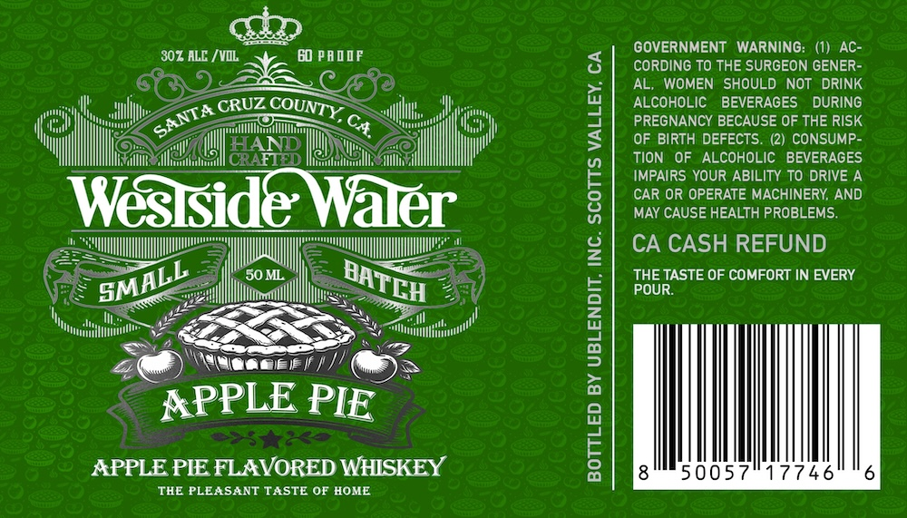

# TTB COLA Label Images - TTBID 26259001000470

**Brand Name:** WESTSIDE WATER

**Issue Date:** 09/18/2026

**Origin Code:** 01

**Product Class/Type:** 149

**Source:** [TTB Public COLA Registry](https://ttbonline.gov/colasonline/viewColaDetails.do?action=publicFormDisplay&ttbid=26259001000470)

## Label Images

### Label 1

## Extracted Label Text

*Text extracted via OCR - may contain errors*

### Label 1

GOVERNMENT WARNING: (1) AC-
307 ALE / VDL
EO PADOF
8
CORDING TO THE SURGEON GENER -
AL, WOMEN SHOULD NOT
DRINK
CRUZ
ALCOHOLIC
BEVERAGES
DURING
C4
1
PREGNANCY BECAUSE OF THE RISK
OF BIRTH DEFECTS.
(2) CONSUMP-
EB
TION  OF  ALCOHOLIC BEVERAGES
IMPAIRS YOUR ABILITY TO DRIVE A
Weslside Waler
!
CAR OR OPERATE MACHINERY AND
MAY CAUSE HEALTH PROBLEMS.
4
CA CASH REFUND
S0M
THE TASTE OF COMFORT IN EVERY
POUR:
1
6
APPLE PIE
APPLE PEE FLAVORED WHISKEY
1
50057
17746
THE PLEASANT TASTE OF HOME
COUNTY,
SANTA
SMALL
BATCH
