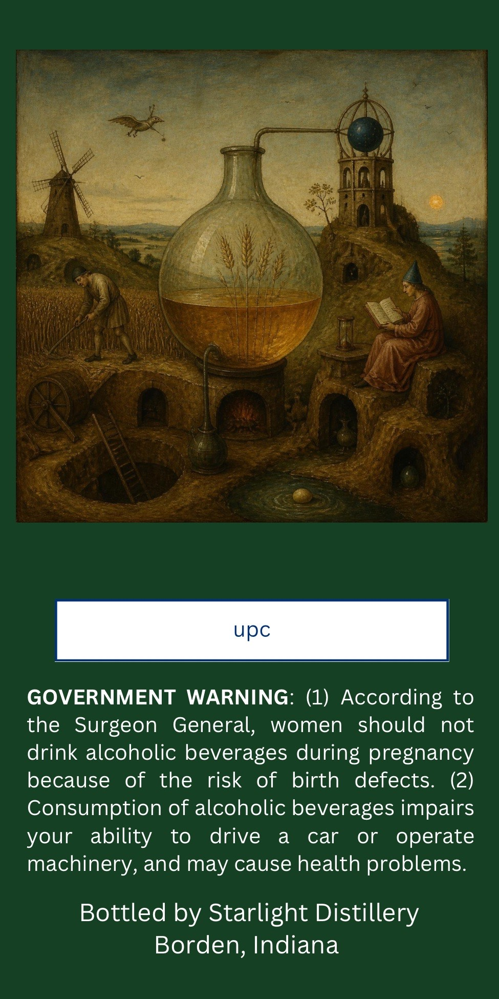
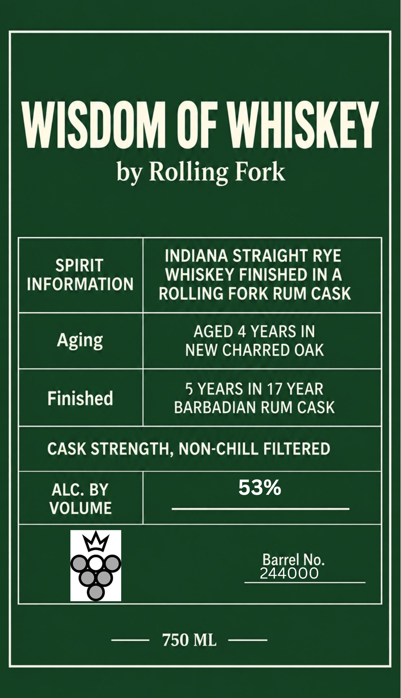

# TTB COLA Label Images - TTBID 26259001000531

**Brand Name:** ROLLING FORK

**Fanciful Name:** WISDOM OF WHISKEY

**Issue Date:** 09/21/2026

**Origin Code:** 19

**Product Class/Type:** 102

**Source:** [TTB Public COLA Registry](https://ttbonline.gov/colasonline/viewColaDetails.do?action=publicFormDisplay&ttbid=26259001000531)

## Label Images

### Back Label

### Front Label

## Extracted Label Text

*Text extracted via OCR - may contain errors*

**Detected Proof:** 106
**Detected Age:** 4 Years

### Back Label

upc

GOVERNMENT WARNING: (1) According to
the Surgeon General, women should not
drink alcoholic beverages during pregnancy
because of the risk of birth defects. (2)
Consumption of alcoholic beverages impairs
your ability to drive a car or operate
machinery, and may cause health problems.

Bottled by Starlight Distillery
Borden, Indiana

### Front Label

WISDOM OF WHISKEY
by Rolling Fork
INDIANA STRAIGHT RYE
SPIRIT
WHISKEY FINISHED IN A
INFORMATION
ROLLING FORK RUM CASK
AGED 4 YEARS IN
Aging
NEW CHARRED OAK
5 YEARS IN 17 YEAR
Finished
BARBADIAN RUM CASK
CASK STRENGTH, NON-CHILL FILTERED
ALC. BY
53%
VOLUME
Barrel No.
244000
750 ML
