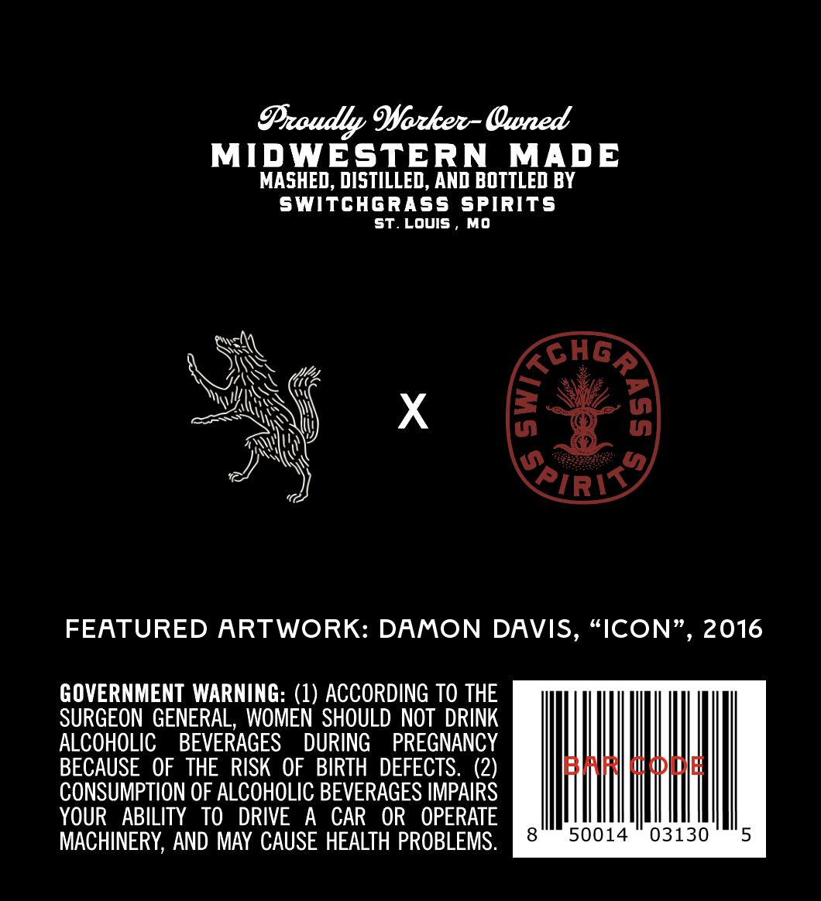
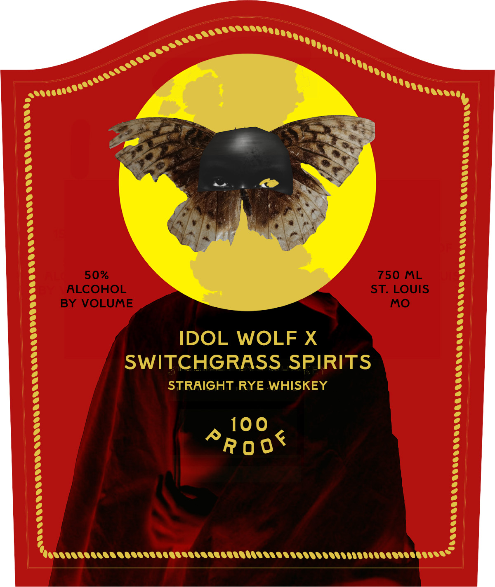

# TTB COLA Label Images - TTBID 26259001000542

**Brand Name:** SWITCHGRASS SPIRITS

**Fanciful Name:** IDOL WOLF

**Issue Date:** 09/18/2026

**Origin Code:** 29

**Product Class/Type:** 102

**Source:** [TTB Public COLA Registry](https://ttbonline.gov/colasonline/viewColaDetails.do?action=publicFormDisplay&ttbid=26259001000542)

## Label Images

### Back Label

### Front Label

## Extracted Label Text

*Text extracted via OCR - may contain errors*

**Detected Proof:** 100

### Back Label

Proudly Worker- Owned
MIDWESTERN MADE
MASHED, DISTILLED, AND BOTTLED BY
SWITCHGRASS SPIRITS
ST.LOUIS, MO
we
ON a Ones
BUN \\ xX zi
, wi w
_ AN OED
a) SIRS
FEATURED ARTWORK: DAMON DAVIS, “ICON”, 2016
GOVERNMENT WARNING: (1) ACCORDING TO THE
SURGEON GENERAL, WOMEN SHOULD NOT DRINK | || | | |
ALCOHOLIC BEVERAGES DURING PREGNANCY
BECAUSE OF THE RISK OF BIRTH DEFECTS. (2) STAR CIDIn
CONSUMPTION OF ALCOHOLIC BEVERAGES IMPAIRS il | | | | |
YOUR ABILITY TO DRIVE A CAR OR OPERATE
MACHINERY, AND MAY CAUSE HEALTH PROBLEMS. [iRgiiieanUse mince mai

### Front Label

50%
750 ML
ALCOHOL
ST: LOUIS
BY VOLUME
MO
IDOL WOLF X
SWITCHGRASS SPIRITS
STRAIGHT RYE WHISKEY
100
^R 0 0 <
