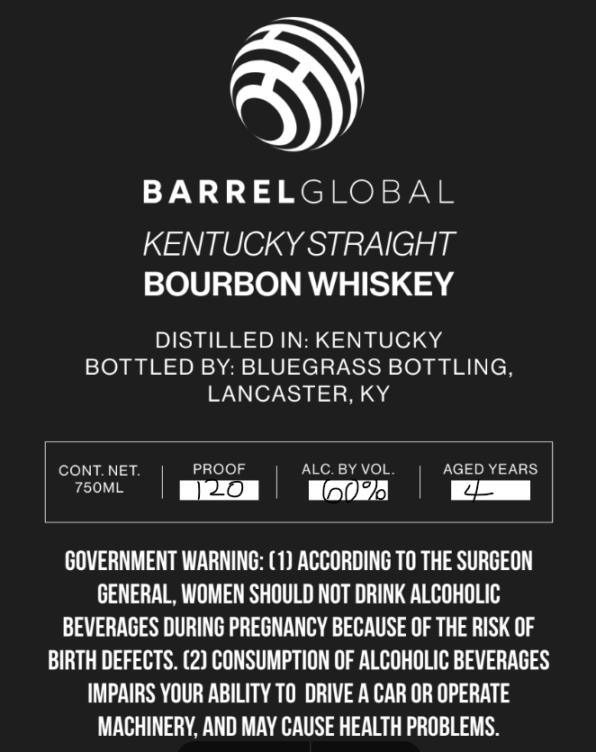
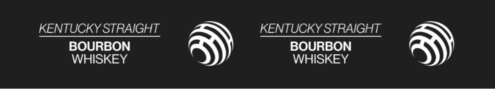

# TTB COLA Label Images - TTBID 26259001000591

**Brand Name:** BARREL GLOBAL

**Issue Date:** 09/18/2026

**Origin Code:** 22

**Product Class/Type:** 101

**Source:** [TTB Public COLA Registry](https://ttbonline.gov/colasonline/viewColaDetails.do?action=publicFormDisplay&ttbid=26259001000591)

## Label Images

### Front Label

### Label 2

## Extracted Label Text

*Text extracted via OCR - may contain errors*

### Front Label

BARRELGLOBAL
KENTUCKY STRAIGHT
BOURBON WHISKEY
DISTILLED IN: KENTUCKY
BOTTLED BY: BLUEGRASS BOTTLING,
LANCASTER, KY
CONT.NET:
PROOF
ALC. BY VOL_
AGED YEARS
750ML
20
ko
GOVERNMENT WARNING: ( 1) ACCORDINC TO THE SURCEON
GENERAL, WOMEN SHOULD NOT DRINK ALCOHOLIC
BEVERACES DURINC PRECNANCY BECAUSE OF THE RISK OF
BIRTH DEFECTS. (2) CONSUMPTION OF ALCOHOLIC BEVERACES
IMPAIRS YOUR ABILITY TO  DRIVE A CAR OR OPERATE
MACHINERY; AND MAY CAUSE HEALTH PROBLEMS

### Label 2

KENTUCKY STRAIGHT KENTUCKY STRAIGHT
BOURBON BOURBON
WHISKEY WHISKEY
