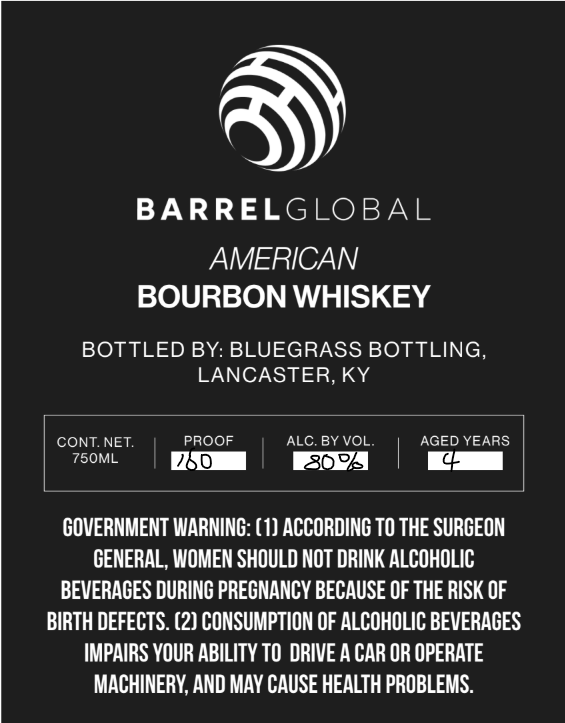
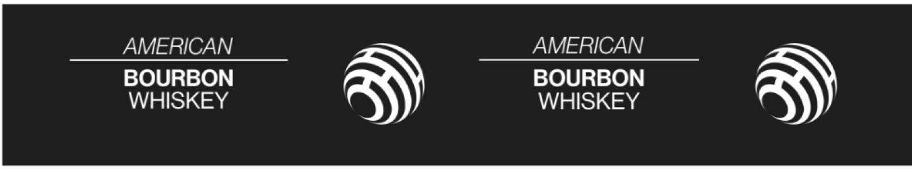

# TTB COLA Label Images - TTBID 26259001000597

**Brand Name:** BARREL GLOBAL

**Issue Date:** 09/22/2026

**Origin Code:** 22

**Product Class/Type:** 141

**Source:** [TTB Public COLA Registry](https://ttbonline.gov/colasonline/viewColaDetails.do?action=publicFormDisplay&ttbid=26259001000597)

## Label Images

### Front Label

### Label 2

## Extracted Label Text

*Text extracted via OCR - may contain errors*

### Front Label

BARRELGLOBAL
AMERICAN
BOURBON WHISKEY
BOTTLED BY: BLUEGRASS BOTTLING
LANCASTER,KY
CONT NET:
PROOF
ALC. BY VOL
AGED YEARS
75OML
260
362
GOVERNMENT WARNING: (1) ACCORDING TO THE SURGEON
GENERAL, WOMEN SHOULD NOT DRINK ALCOHOLIC
BEVERACES DURINC PRECNANCY BECAUSE OF THE RISK OF
BIRTH DEFECTS. (2) CONSUMPTION OF ALCOHOLIC BEVERAGES
IMPAIRS YOUR ABILITY TO DRIVE A CAR OR OPERATE
MACHINERY, AND MAY CAUSE HEALTH PROBLEMS:

### Label 2

AMERICAN AMERICAN
BOURBON BOURBON
WHISKEY WHISKEY
