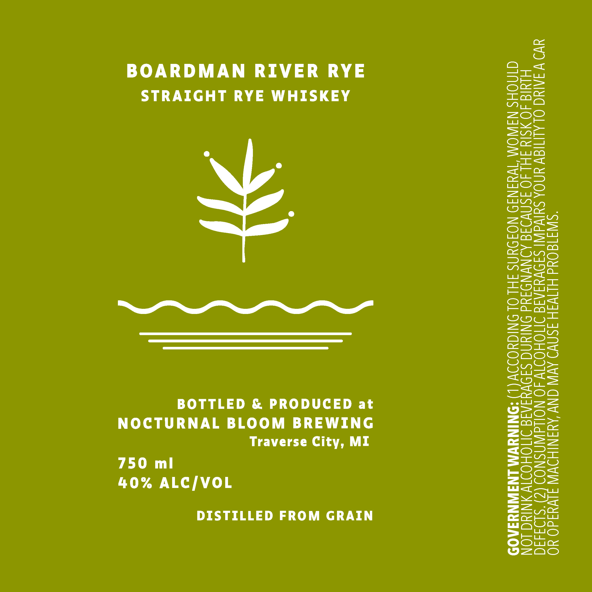

# TTB COLA Label Images - TTBID 26259001000762

**Brand Name:** NOCTURNAL BLOOM BREWING

**Fanciful Name:** BOARDMAN RIVER RYE

**Issue Date:** 09/21/2026

**Origin Code:** 06

**Product Class/Type:** 102

**Source:** [TTB Public COLA Registry](https://ttbonline.gov/colasonline/viewColaDetails.do?action=publicFormDisplay&ttbid=26259001000762)

## Label Images

### Label 1

## Extracted Label Text

*Text extracted via OCR - may contain errors*

**Detected Proof:** 80

### Label 1

BOARDMAN RIVER RYE
STRAIGHT RYE WHISKEY

BOTTLED & PRODUCED at
NOCTURNAL BLOOM BREWING
Traverse City, MI
750 mil
40% ALC/VOL

DISTILLED FROM GRAIN

OMEN SHOULD
RISK OF BIRTH
ILITYTO DRIVE A CAR

THE
RAB

R
OF
U

CONSUMPTION OF ALCOHOLIC BEVERAGES IMPAIRS YO

2
OR SBERATE MACHINERY, AND MAY CAUSE HEALTH PROBLEMS.

ENERA
SE
Y

ACCORDING TO THE SURGEON G

AGES DURING PREGNANCY BECAU

1

GOVERNMENT WARNING
NOT DRINK ALCOHOLIC BEVE

DEFECTS.
