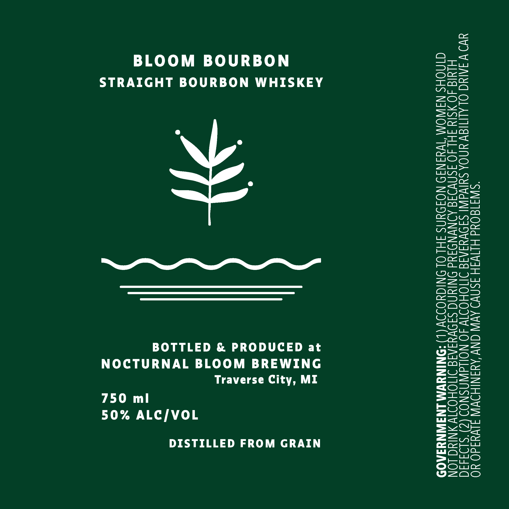

# TTB COLA Label Images - TTBID 26259001000763

**Brand Name:** NOCTURNAL BLOOM BREWING

**Fanciful Name:** BLOOM BOURBON

**Issue Date:** 09/21/2026

**Origin Code:** 06

**Product Class/Type:** 101

**Source:** [TTB Public COLA Registry](https://ttbonline.gov/colasonline/viewColaDetails.do?action=publicFormDisplay&ttbid=26259001000763)

## Label Images

### Label 1

## Extracted Label Text

*Text extracted via OCR - may contain errors*

**Detected Proof:** 100

### Label 1

BLOOM BOURBON
STRAIGHT BOURBON WHISKEY

BOTTLED & PRODUCED at
NOCTURNAL BLOOM BREWING
Traverse City, MI

750 ml
50% ALC/VOL

DISTILLED FROM GRAIN

1) ACCORDING TO THE SURGEON GENERAL, WOMEN SHOULD
NOT DRINK ALCOHOLIC BEVERAGES DURING PREGNANCY BECAUSE OF THE RISK OF BIRTH

CONSUMPTION OF ALCOHOLIC BEVERAGES IMPAIRS YOUR ABILITY TO DRIVE A CAR

2
OR OPERATE MACHINERY, AND MAY CAUSE HEALTH PROBLEMS.

GOVERNMENT WARNING

DEFECTS.
