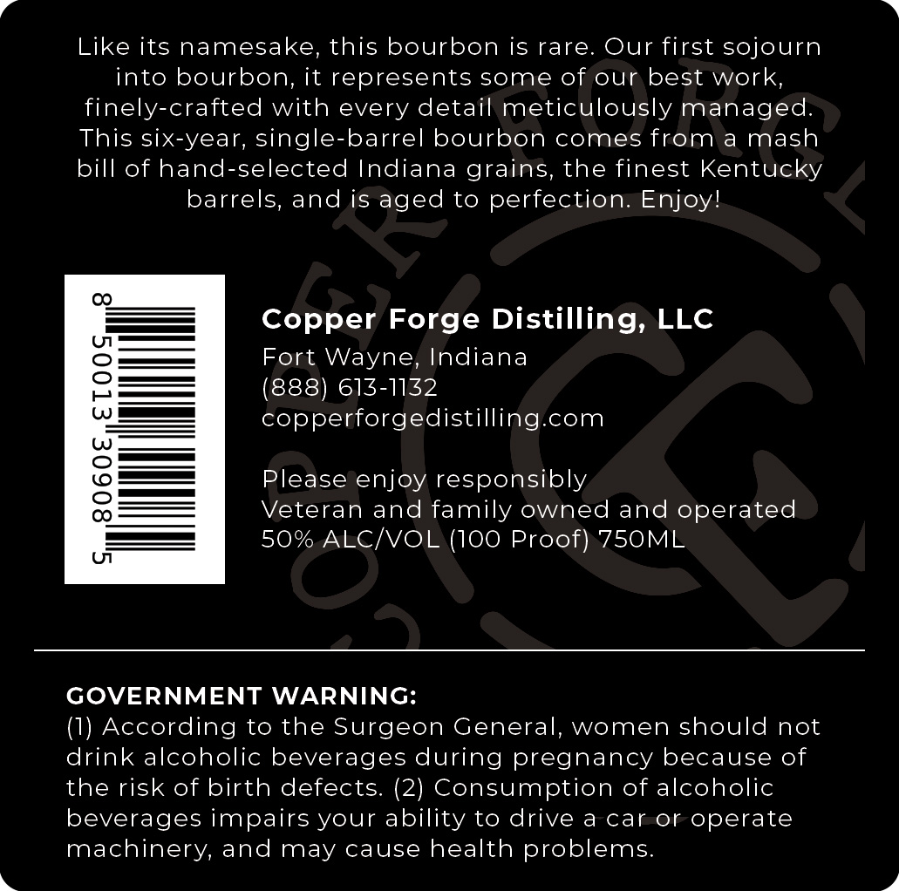
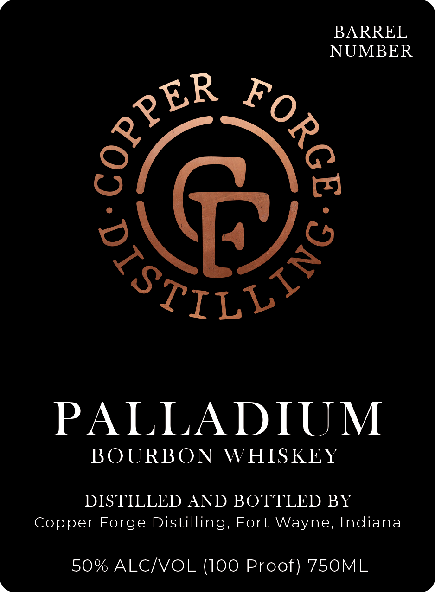

# TTB COLA Label Images - TTBID 26260001000033

**Brand Name:** PALLADIUM

**Issue Date:** 10/02/2026

**Origin Code:** 19

**Product Class/Type:** 141

**Source:** [TTB Public COLA Registry](https://ttbonline.gov/colasonline/viewColaDetails.do?action=publicFormDisplay&ttbid=26260001000033)

## Label Images

### Back Label

### Front Label

## Extracted Label Text

*Text extracted via OCR - may contain errors*

**Detected Proof:** 100

### Back Label

Like its namesake, this bourbon is rare: Our first sojourn
into bourbon; it represents some of our best work,
finely-crafted with every detail meticulously managed.
This six-year, single-barrel bourbon comes from a mash
bill of hand-selected Indiana grains, the finest Kentucky
barrels; and is aged to perfection: Enjoyl
Copper Forge Distilling, LLC
Fort Wayne, Indiana
(888) 613-1132
1
copperforgedistilling com
Please enjoy responsibly
Veteran and family owned and operated
50% ALCNOL (100 Proof) 750ML
UT
GOVERNMENT
WARNING:
(1) According to the Surgeon General, women should not
drink alcoholic beverages during pregnancy because of
the risk of birth defects: (2) Consumption of alcoholic
beverages impairs your ability to drive a car or operate
machinery, and may cause health problems:

### Front Label

BARREL
NUMBER
6
3ILDs
PALLADIUM
BOURBON
WHISKEY
DISTILLED AND BOTTLED BY
Copper Forge Distilling, Fort Wayne, Indiana
50% ALCNOL (100 Proof) 750ML
GOPPEP
9
