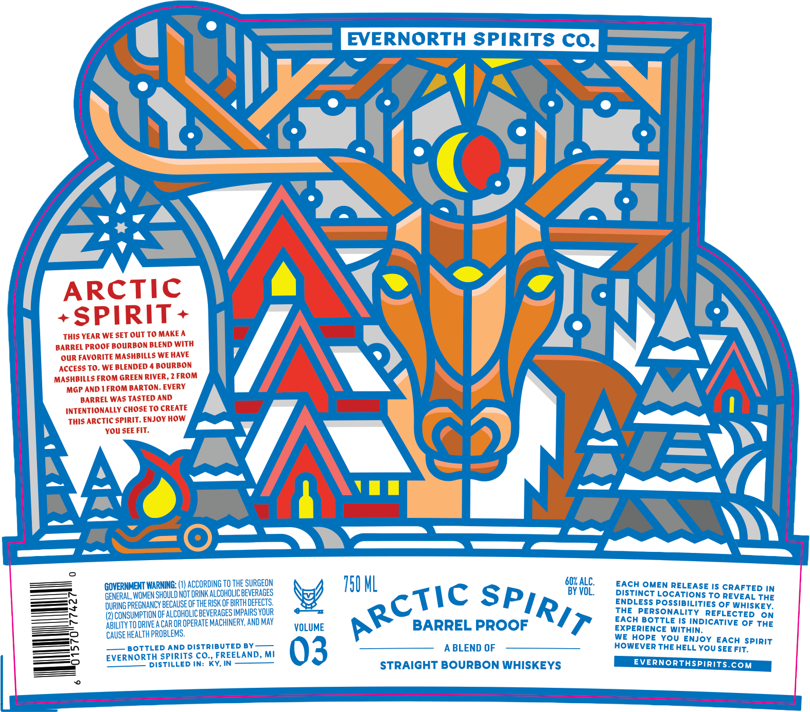

# TTB COLA Label Images - TTBID 26260001000067

**Brand Name:** EVERNORTH SPIRITS CO.

**Issue Date:** 09/22/2026

**Origin Code:** 06

**Product Class/Type:** 121

**Source:** [TTB Public COLA Registry](https://ttbonline.gov/colasonline/viewColaDetails.do?action=publicFormDisplay&ttbid=26260001000067)

## Label Images

### Label 1

## Extracted Label Text

*Text extracted via OCR - may contain errors*

**Detected Proof:** 120

### Label 1

EVERNORTH SPIRITS CO_
ARCTIC
+SPIRIT
THis YEAR WE SET OUT TO MAKE A
BARREL PROOF BOURBON BLEND WITH
OUR FAVORITE MASHBILLS WE HAVE
ACCESS TO. WE BLENDED
BOURBON
MASHBILLS FROM GREEN RIVER, 2 FROM
MGP AND 1 FROM BARTON: EVERY
BARREL WAS TASTED AND
INTENTIONALLY CHOSE TO CREATE
This ArcTIC SPirit: ENJOY HOw
You SEE FIT:
GOVERNMENT WARNING: (1) ACCORDING To The SURGEON
750 ML
60%
'VUE
EACH Omen RELEASE Is CRAFTED IN
GENERAL, women Should NOT DRINK ALCOHOLICBEVERAGES
BY
Distinct LOCATiONS To REVEAL The
DURING PREGNANCY BECAuSE oFthERISK QFBIRTH DEFECTS
ENDLess Rossibilities OF Whiskey:
) CONSUMPTION OF ALCOHOLICBEVERAGES IMPAIRS YOUR
ThE_PERSONALITY REFLECTED
On
ABILITY TO DRIVEA CAR OR OPERATEMACHUNERY,AND May
VOLUME
BARREL PROOF
EACH BottLe IS INDIcATiVE OF The
CAUSE HEALTH PROBLEMS:
WPHOPNCY
Hopncvouithnoy
EACH spirit
bottled AnD Distributer By_
03
A BLEND OF
HoweVeR THE HELL You SEE FIT:
EVERNORTH SPirits Co  FREELAND, Mi
DIstiLLED IN: KY; IN
STRAIGHT BOURBON WHISKEYS
EVERNORTHSPIRITS COM
ARCTIc
SPIRIT
