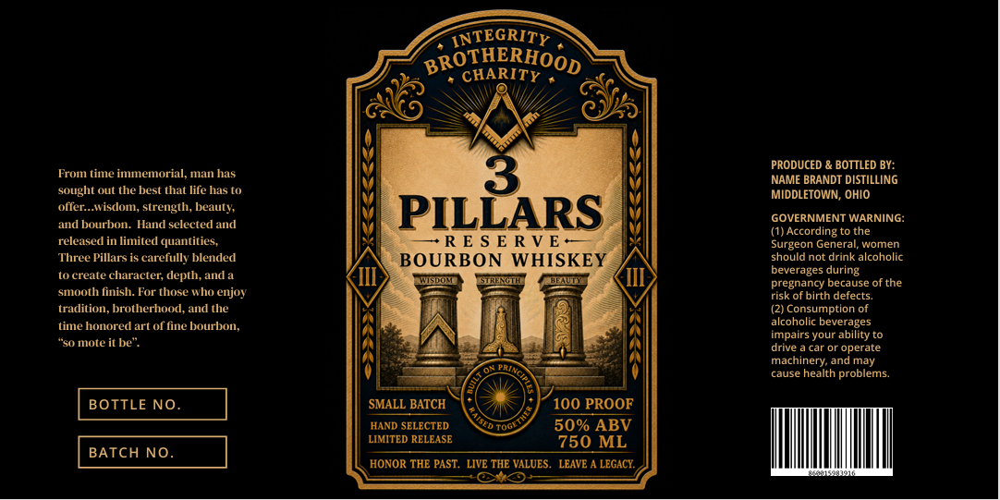

# TTB COLA Label Images - TTBID 26260001000088

**Brand Name:** 3 PILLARS RESERVE

**Issue Date:** 09/21/2026

**Origin Code:** 09

**Product Class/Type:** 141

**Source:** [TTB Public COLA Registry](https://ttbonline.gov/colasonline/viewColaDetails.do?action=publicFormDisplay&ttbid=26260001000088)

## Label Images

### Label 1

## Extracted Label Text

*Text extracted via OCR - may contain errors*

**Detected Proof:** 100

### Label 1

INTEGRITY
BROTHERHOOD
PRODUCED & BOTTLED BY:
From titne innemorial, Inan has
3
NAME BRANDT DISTILLING
sought out the best that life has t0
MIDDLETOWN, OHIO
offer:_Wisdon, strength, beauty;
PILLARS
GOVERNMENT WARNING:
and bourbon: Hand selected and
(1) According to the
released in limited quantities,
R E $ E RVE ~
Surgeon General; women
Pillars is carefully blended
BOURBON
WHISKEY
should not drink alcoholic
to crealee
character; depth; and
CHFAU
beverages during
IIsDO
STREAGTH
pregnancy because of the
stnooth finish: For those who enjoy
risk of birth defects
tradition
brotherhood, and the
(2) Consumption of
time honored art of fine bourbon;
alcoholic beverages
impairs your ability to
"S0 mote
drive
car or operate
machinery; and may
cause health problems.
BOTTLE NO.
SMALL BATCH
100 PROOF
HAND SELECTED
50% ABV
LIMITED RELEASE
750 ML
BATCH NO.
HONOR THE PAST
LIVE THE VALUES.
LEAVE
LEGACY
Three
UD
Toge
