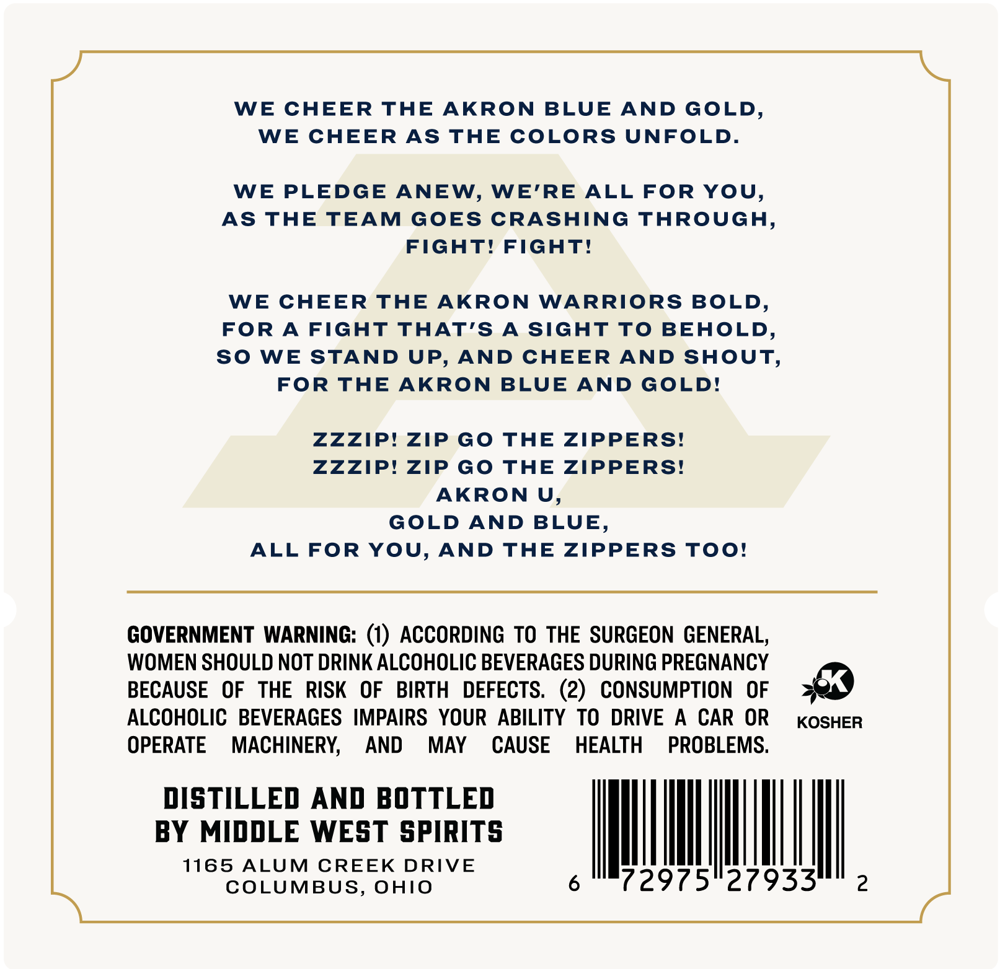
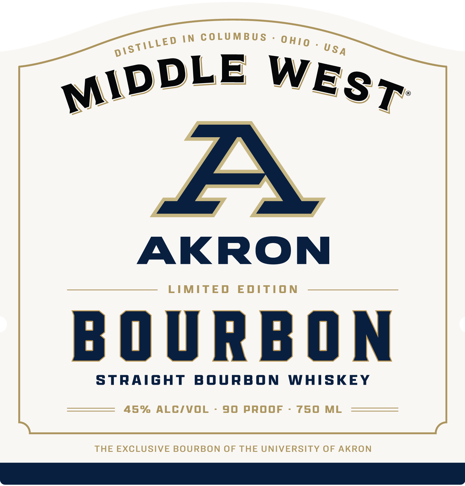

# TTB COLA Label Images - TTBID 26260001000273

**Brand Name:** MIDDLE WEST

**Fanciful Name:** AKRON

**Issue Date:** 09/18/2026

**Origin Code:** 09

**Product Class/Type:** 101

**Source:** [TTB Public COLA Registry](https://ttbonline.gov/colasonline/viewColaDetails.do?action=publicFormDisplay&ttbid=26260001000273)

## Label Images

### Back Label

### Front Label

### Label 3

## Extracted Label Text

*Text extracted via OCR - may contain errors*

*1 image(s) excluded: text did not meet readability threshold*

**Detected Proof:** 90

### Back Label

WE CHEER THE AKRON BLUE AND GOLD

WE CHEER AS THE COLORS UNFOLD

WE PLEDGE ANEW, WE’RE ALL FOR YOU,

AS THE TEAM GOES CRASHING THROUGH

FIGHT! FIGHT!

WE CHEER THE AKRON WARRIORS BOLD

FOR A FIGHT THAT’S A SIGHT TO BEHOLD

SO WE STAND UP, AND CHEER AND SHOUT,

FOR THE AKRON BLUE AND GOLD!

ZZZIP! ZIP GO THE ZIPPERS!

ZZZIP! ZIP GO THE ZIPPERS!

AKRON U

GOLD AND BLUE

ALL FOR YOU, AND THE ZIPPERS TOO!

GOVERNMENT WARNING: (1) ACCORDING TO THE SURGEON GENERAL

WOMEN SHOULD NOT DRINK ALCOHOLIC BEVERAGES DURING PREGNANCY

BECAUSE OF THE RISK OF BIRTH DEFECTS. (2) CONSUMPTION OF

#9

ALCOHOLIC BEVERAGES IMPAIRS YOUR ABILITY TO DRIVE A CAR OR

KOSHER

OPERATE MACHINERY, AND MAY CAUSE HEALTH PROBLEMS

DISTILLED AND BOTTLED

BY MIDDLE WEST SPIRITS

1165 otum coe On DRIVE

|

VM

|

MBUS

6

72975°27933

2

### Front Label

IN COLUMBUS
74
AKRON
LIMITED
EdITION
B O URB ON
StRAIGHT
BouRBON
WHISKEY
45%
ALCIVOL
90
pROOF
750
ML
THE EXCLUSIVE BOURBON OF THE UNIVERSITY OF AKRON
0 HO
DISTILLED
USA
MIDDLE
WEST
