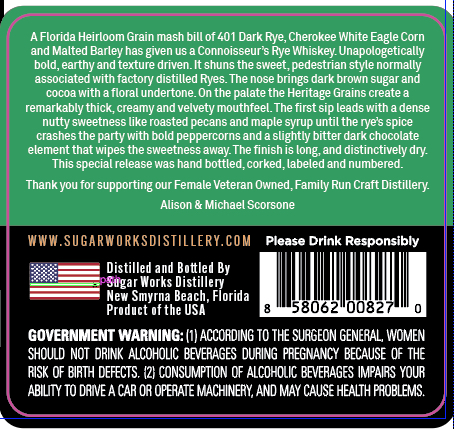
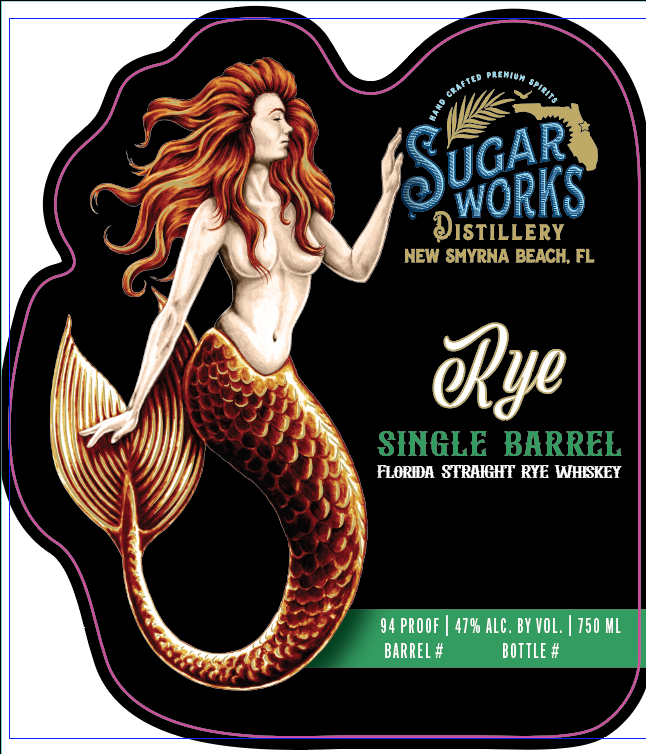

# TTB COLA Label Images - TTBID 26260001000304

**Brand Name:** SUGAR WORKS DISTILLERY

**Issue Date:** 09/23/2026

**Origin Code:** 16

**Product Class/Type:** 102

**Source:** [TTB Public COLA Registry](https://ttbonline.gov/colasonline/viewColaDetails.do?action=publicFormDisplay&ttbid=26260001000304)

## Label Images

### Back Label

### Front Label

## Extracted Label Text

*Text extracted via OCR - may contain errors*

**Detected Proof:** 94

### Back Label

AFlorida Heirloom Grain mash bill of 401 Dark Rye, Cherokee White Eagle Corn
and Malted Barley has given US
Connoisseur s Rye Whiskey Unapologetically
bold;earthy and texture driven.
shuns the sweet,pedestrian style normally
associated with factory distilled Ryes_The nose
dark brown sugar and
cocoa with a floral undertone.On the palate the Heritage Grains create &
remarkably thick creamy and velvety mouthfeel_The first sip leads with
dense
nutty sweetness like roasted pecans and maple syrup until the ryes spice
crashes the party with bold peppercorns and
slightly bitter dark chocolate
element-
that wipes the sweetness away The finish is long,and distinctively dry
This special release was hand bottled,corked, labeled and numbered.
Thank you for supporting our Female Veteran Owned,Family Run Craft Distillery:
Alison
Michael Scorsone
WWW.SUGARWORKSDISTILLERY.COM
Please Drink Responsibly
Distilled and Bottled By
Sugar Works Distillery
New Smyrna Beach, Fiorida
Product of the USA
58062"0082
GOVERNMENT WARNING:
ACCORDING TO THE SUAGEON GENERAL, WOMEN
SHOULD NOT drINK  ALcohoLIC BevERAGES DupInG   PREGNANCY BECAUSE OF THE
RISK OF BIRTH DEFECTS  {2} CONSUMPTION OF ALCOHOLIC BEVERAGES IMPAIRS YOUR
ABILITY TO DAIVE A CAR OR OPERATE MACHINERY,AND MAY CAUSE HEALTH FAOBLEMS
brings

### Front Label

WORKS
DISTILLERY
NEW SMYRNA BEACH; FL
@ye
SINGLE BARREL
FLORIDA  STRAIGHT RYE WHISKEY
94 PROOF
479 aLC . BY VOL:
750 ML
BaRREL #
bottle #
UGAR
