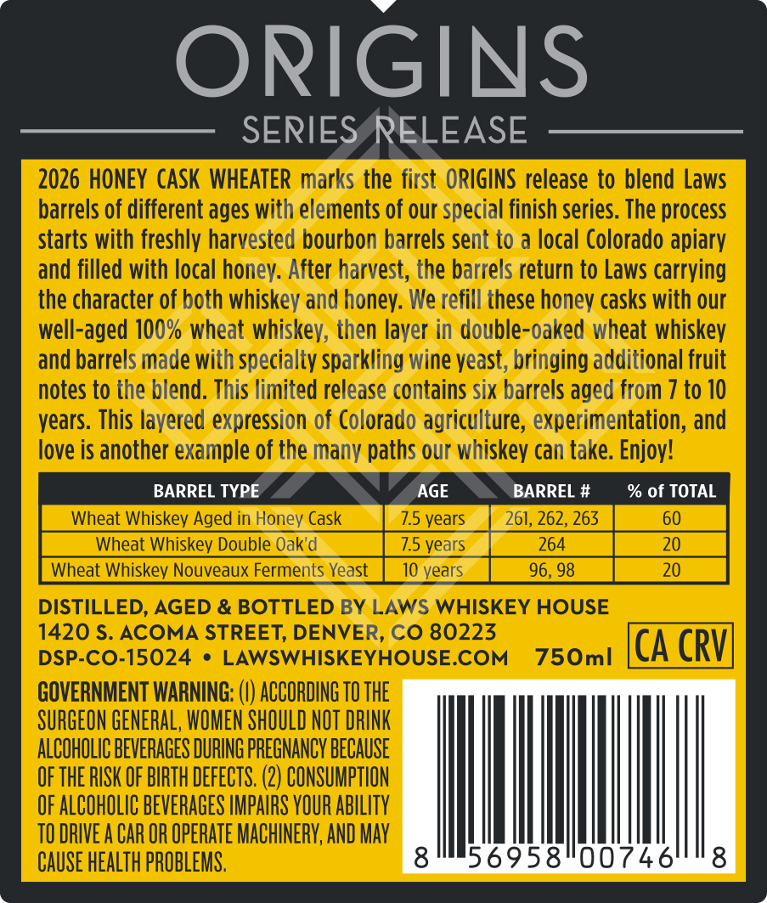
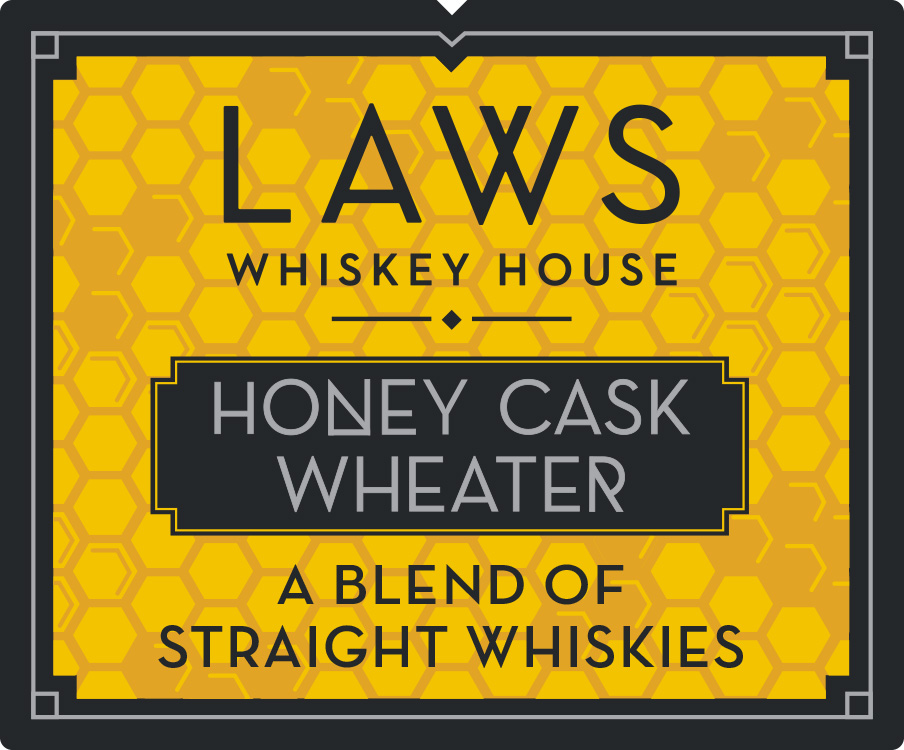
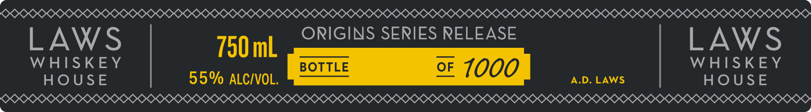

# TTB COLA Label Images - TTBID 26260001000417

**Brand Name:** LAWS WHISKEY HOUSE

**Fanciful Name:** HONEY CASK WHEATER

**Issue Date:** 10/01/2026

**Origin Code:** 13

**Product Class/Type:** 139

**Source:** [TTB Public COLA Registry](https://ttbonline.gov/colasonline/viewColaDetails.do?action=publicFormDisplay&ttbid=26260001000417)

## Label Images

### Back Label

### Front Label

### Label 2

### Label 3

## Extracted Label Text

*Text extracted via OCR - may contain errors*

**Detected Proof:** 110

### Back Label

ORIGINS
SERIES RELEASE
2026 HONEY CASK WHEATER marks the first  ORIGINS release to blend Laws
barrels of different ages with elements of our special finish series. The process
starts with freshly harvested bourbon barrels sent to a local Colorado apiary
and filled with local honey: After harvest; the barrels return to Laws carrying
the character of both whiskey and honey: We refill these honey casks with our
well-aged 100% wheat whiskev; then layer in double-oaked wheat whiskey
and barrels made with specialty sparkling wine veast, bringing additional fruit
notes to the blend. This limited release contains six barrels aged from 7 to 10
vears. This layered expression of Colorado agriculture; experimentation; and
love is another example of the many paths our whiskey can take: Enjoy!
BARREL TYPE
AGE
BARREL #
% of TOTAL
Wheat Whiskey Aged in Honey Cask
7.5 vears
261, 262,263
60
Wheat Whiskev Double Oak'd
7.5 vears
264
20
Wheat Whiskey Nouveaux Ferments Yeast
10 vears
96,98
20
DISTILLED, AGED & BOTTLED BY LAWS WHISKEY HOUSE
1420 $. ACOMA STREET, DENVER, CO 80223
DSP-CO-15024
LAWSWHISKEYHOUSE.COM
750ml
CA CRV
GOVERNMENT WARNING: !
ACCORDING TO THE
SURGEON GENERAL, WOMEN SHOULD NOT DRINK
ALCOHOLIC BEVERAGES DURING PREGNANCY BECAUSE
OF THE RISK OF BIRTH DEFECTS: (2) CONSUMPTION
OF ALCOHOLIC BEVERAGES IMPAIRS YOUR AbILITy
TO DRIVE A CAR OR OPERATE MACHINERV; AND May
CAUSE healTh PROBLEMS.
8
56958"00746
8

### Front Label

LAWS
WHISKEY
HOUsE
HONEY CASK
WHEATER
A
BLEND OF
STRAIGHT WHISKIES

### Label 2

ee t—~—
PSORRRROOD? XKKRORRG
Sexe SOOO OQRRRLN CVS
PREETI OSH RARER RBIS IIIS
. *5 . .
° ° Zz () Zz ‘ ° ‘©:
SKK LKR
SOO EKKXKKX> OKKKKKXRLLRLR
SEEKS SKI ION ORIGINS SERIES RELEASE onececeatetnatstceateconenseentataes ees Se

### Label 3

LAWS
750ml
ORIGINS SERIES RELEASE
LAWS
WHISKEY
BOTTLE
QF 1000
WHISKEY
HOUSE
55% ALCIVOL,
A.D. LAWS
HOUSE
