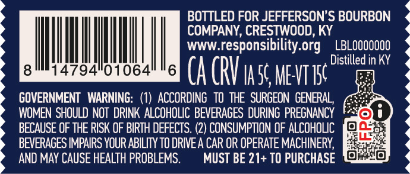
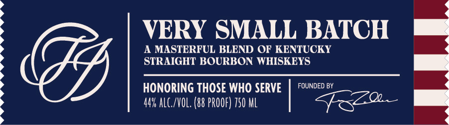
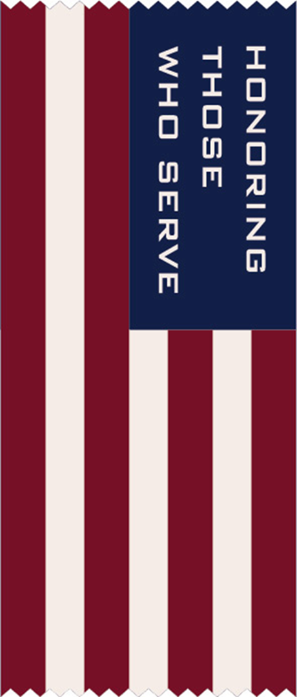

# TTB COLA Label Images - TTBID 26260001000429

**Brand Name:** JEFFERSON'S

**Issue Date:** 09/22/2026

**Origin Code:** 12

**Product Class/Type:** 121

**Source:** [TTB Public COLA Registry](https://ttbonline.gov/colasonline/viewColaDetails.do?action=publicFormDisplay&ttbid=26260001000429)

## Label Images

### Back Label

### Front Label

### Label 3

### Label 5

### Label 6

## Extracted Label Text

*Text extracted via OCR - may contain errors*

*3 image(s) excluded: text did not meet readability threshold*

**Detected Proof:** 88

### Back Label

BOTTLED FOR JEFFERSON'S BOURBON
COMPANY, CRESTWOOD, KY
WWW_
responsibility org '
LBLOOOOOOO
Distilled in KY
14794"01064
6
Ca CRV _a5c MeVTI5c 5
GOVERNMENT   WARNING: (1)   ACCORDING   TO  THE   SURGEON  GENERAL,
WOMEN SHOULD NOT  DRINK ALCOHOLIC BEVERAGES DURING PREGNANCY
BECAUSE OF THE RISK OF BIRTH DEFECTS: (2) CONSUMPTION OF ALCOHOLIC
BEVERAGES IMPAIRS YOUR ABILITY TO DPIVEA CAR OR OPERATE MACHINERY,
AND MAY CAUSE HEALTH PROBLEMS.
MUST BE 21+ TO PURCHASE

### Front Label

VERY SMALL BATCH
A MASTERFUL BLEND OF KENTUCKY
STRAIGHT BOURBON WHISKEYS
HONORING THOSE WHO SERVE
FOUNDED BY
44% ALC /VOL. (88 PROOF) 750 ML
