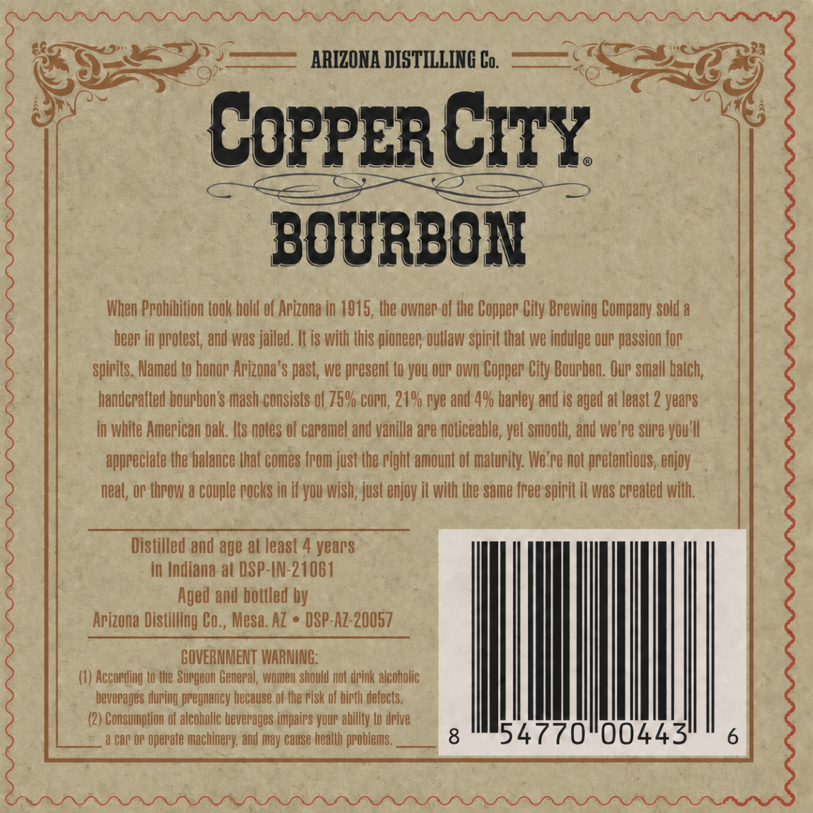
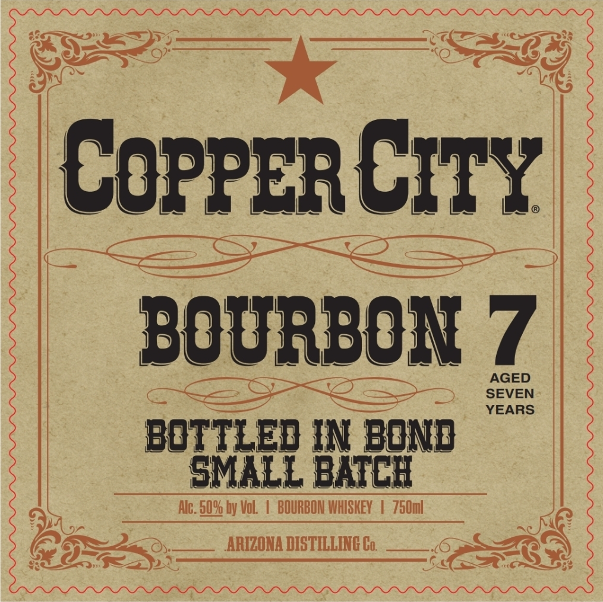

# TTB COLA Label Images - TTBID 26260001000453

**Brand Name:** COPPER CITY

**Issue Date:** 09/28/2026

**Origin Code:** 11

**Product Class/Type:** 111

**Source:** [TTB Public COLA Registry](https://ttbonline.gov/colasonline/viewColaDetails.do?action=publicFormDisplay&ttbid=26260001000453)

## Label Images

### Back Label

### Label 1

## Extracted Label Text

*Text extracted via OCR - may contain errors*

**Detected Age:** 2 Years

### Back Label

ARIZONA DISTILLING Co;
COPPERCITY
BOURBON
When Ppohibition took hold of Arizona in 1915, the owner of the Copper City Brewing Company sold a
beer
protest; and was jailed. It is with this pioneer; Outlaw spirit that we indulge Our' passion fop
spirits. Named to honor Arizona' $ past; we present to yOu OUP Own Copper City Boupbon: Our small baich;
handcrafted bourbon $ mash consists of 75% copn; 219 rye and 49 bapley and is aged at Ieast 2 years
in White American Oak: Its notes of caramel and vanilla are noticeable, yet smooth; and we're Sure yOu'U
appreciate the balance (hat comes from just the pight amount of maturity: We' re not pretentious, enjoy
neaL, Or (hrOw & couple pocks in if you wish; just enjoy it with the Same free spirit [
WaS created with;
Distilled and age at least :
years
in Indiana at DSP-IN-21061
Aged and bottled by
Arizona Distilling Co , Mesa. AZ
DSP-Az-20057
GOVERNMENT WARMING:
According (o Uhe Surgeon General, women should not drink alcoholic
beverages duping pregnancy because of the pisk of hipth defects.
(2) Consumplion of alcoholic beverayes impairs YOUr ability to dpive
car OP operate
machinery; and may Gause health ppoblems.
8
54770"00443'

### Label 1

COPPERCITy
BOURBON 7
AGED
SEVEN
YEARS
bottled IN bond
SMALL BaTCI
Alc; 5094 by Vol
BOURBON WhISHEV
750m|
ARIZONA DISTILLING Co;
