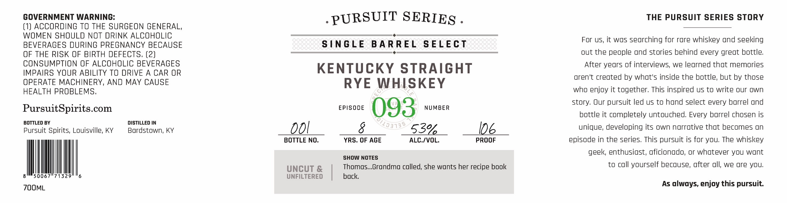
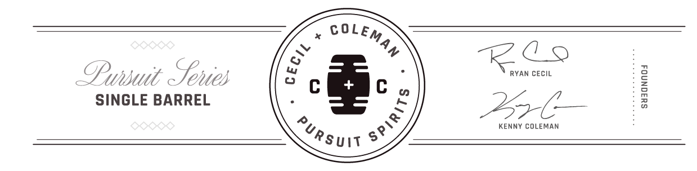

# TTB COLA Label Images - TTBID 26260001000491

**Brand Name:** PURSUIT SERIES

**Fanciful Name:** EPISODE 093

**Issue Date:** 09/22/2026

**Origin Code:** 22

**Product Class/Type:** 102

**Source:** [TTB Public COLA Registry](https://ttbonline.gov/colasonline/viewColaDetails.do?action=publicFormDisplay&ttbid=26260001000491)

## Label Images

### Label 1

### Label 2

## Extracted Label Text

*Text extracted via OCR - may contain errors*

**Detected Proof:** 106

### Label 1

GOVERNMENT WARNING:
PURSUIT SERIES_
THE PURSUIT SERIES STORY
(1) ACCORDING TO THE SURGEON GENERAL,
WOMEN SHOULD NOT DRINK ALCOHOLIC
For US, it was searching for rare whiskey and seeking
BEVERAGES DURING PREGNANCY BECAUSE
SNGLE
B A RREL
S ELEcT
OF THE RISK OF BIRTH DEFECTS, (2)
out the people ond stories behind every great bottle;
CONSUMPTION OF ALCOHOLIC BEVERAGES
KENTUCKY STRAIGHT
After years of interviews; we learned that memories
IMPAIRS YOUR ABILITY TO DRIVE A CAR OR
aren't created by what's inside the bottle, but by those
OPERATE MACHINERY, AND MAY CAUSE
RYE
WHISKEY
HEALTH PROBLEMS,
who enjoy it together; This inspired us to write our own
story. Our pursuit led us to hond select every borrel ond
PursuitSpirits.com
EPISODE
093
NUMBER
bottle it completely untouched: Every barrel chosen is
BOTTLED BY
DISTILLED IN
Pursuit Spirits; Louisville; KY
Bardstown; KY
0OL
53%
106
unique; developing its own narrative that becomes un
BOTTLE NO_
YRS, OF AGE
ALC./VOL
PROOF
episode in the series; This pursuit is for you; The whiskey
geek; enthusiast; aficionado, or whatever you want
SHOW NOTES
UnCUT &
Thomos_Grondmo colled, she wonts her recipe book
to coll yourself because; after oll, we are yOU,
50067"71329
UNFILTERED
back
ZOOML
As always, enjoy this pursuit:
'/13313

### Label 2

COLE;
Lu
RL
OPwnsuit  enies
0
RYAN CECIL
SINGLE BARREL
276
1
KENNY COLEMAN
MAN
3
1
Pursuij
