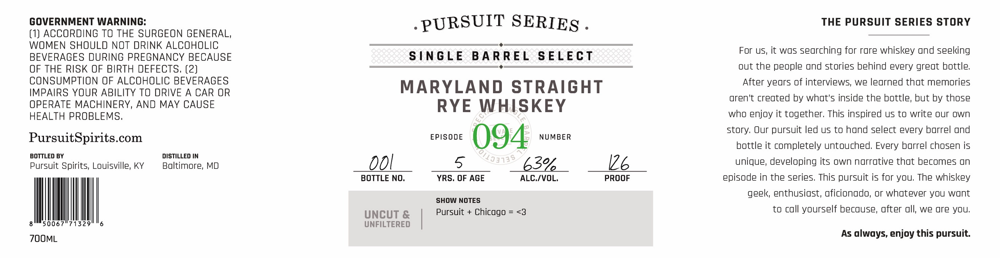

# TTB COLA Label Images - TTBID 26260001000495

**Brand Name:** PURSUIT SERIES

**Fanciful Name:** EPISODE 094

**Issue Date:** 09/22/2026

**Origin Code:** 25

**Product Class/Type:** 102

**Source:** [TTB Public COLA Registry](https://ttbonline.gov/colasonline/viewColaDetails.do?action=publicFormDisplay&ttbid=26260001000495)

## Label Images

### Label 1

### Label 2

## Extracted Label Text

*Text extracted via OCR - may contain errors*

**Detected Proof:** 126

### Label 1

GOVERNMENT WARNING:

PURSUIT SERIEg

THE PURSUIT SERIES STORY

1) ACCORDING TO THE SURGEON GENERAL

WOMEN SHOULD NOT DRINK ALCOHOLIC

BEVERAGES DURING PREGNANCY BECAUSE

SINGLE BARREL SELECT

For us, it was searching for rare whiskey and seeking

OF THE RISK OF BIRTH DEFECTS. (2)

out the people and stories behind every great bottle

CONSUMPTION OF ALCOHOLIC BEVERAGES

After years of interviews, we learned that memories

MPAIRS YOUR ABILITY TO DRIVE A CAR OR

MARYLAND STRAIGHT

OPERATE MACHINERY, AND MAY CAUSE

aren't created by what's inside the bottle, but by those

RYE WHISKEY

HEALTH PROBLEMS

who enjoy it together. This inspired us to write our own

story. Our pursuit led us to hand select every barrel and

PursuitSpirits.com

wom (QQA. wm

bottle it completely untouched. Every barrel chosen is

BOTTLED BY

DISTILLED IN

Pursuit Spirits, Louisville, KY

Baltimore, MD

00!

&

63%

Le

unique, developing its own narrative that becomes an

BOTTLE NO

YRS. OF AGE

ALC./VOL,

PROOF

episode in the series, This pursuit is for you. The whiskey

geek, enthusiast, aficionado, or whatever you want

SHOW NOTES

}

UNCUT &

to call yourself because, after all, we are you

8

50067°71329

UNFILTERED

| Pursuit + Chicago = <3

As always, enjoy this pursuit.

7OOML

### Label 2

COLE;
Lu
RL
OPwnsuit  enies
0
RYAN CECIL
SINGLE BARREL
276
1
KENNY COLEMAN
MAN
3
1
Pursuij
